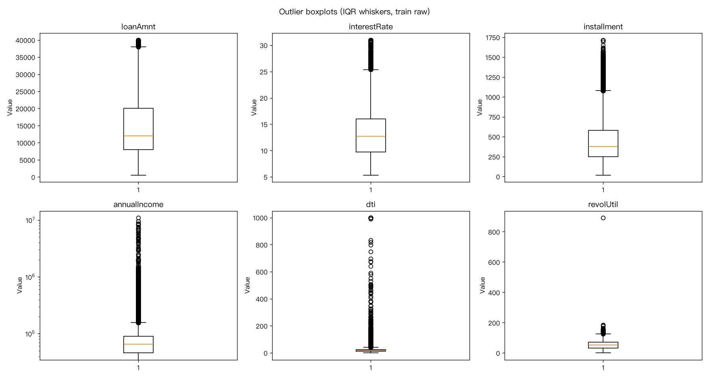
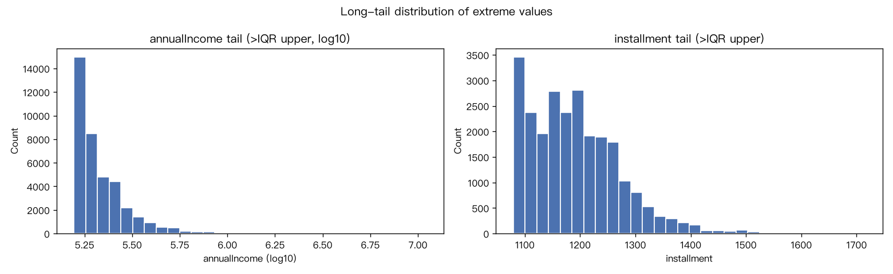
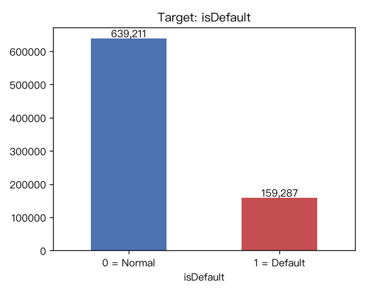
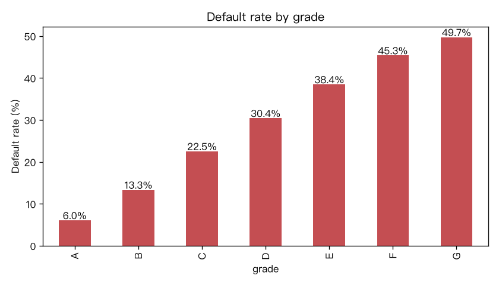
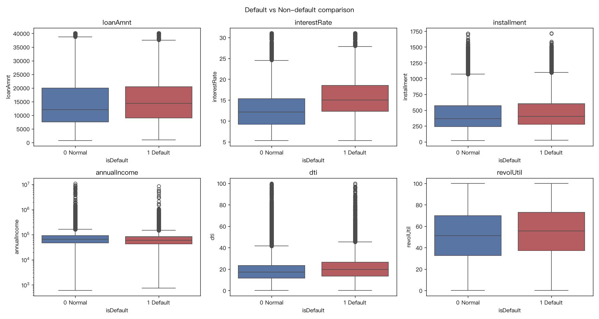
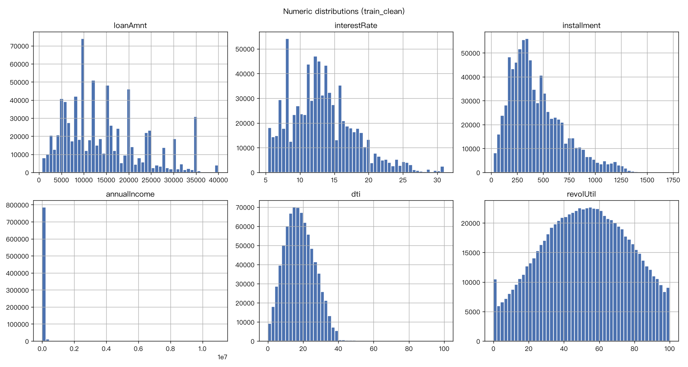
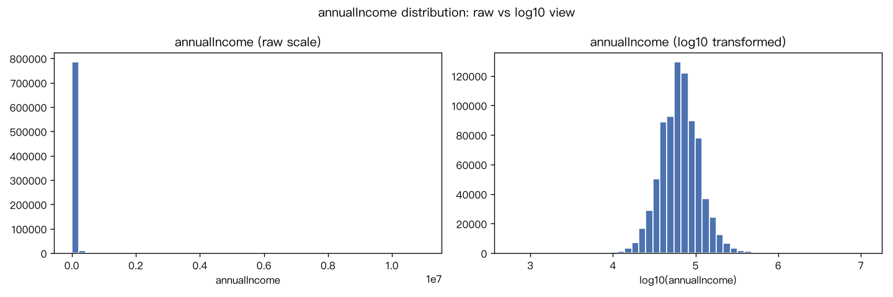
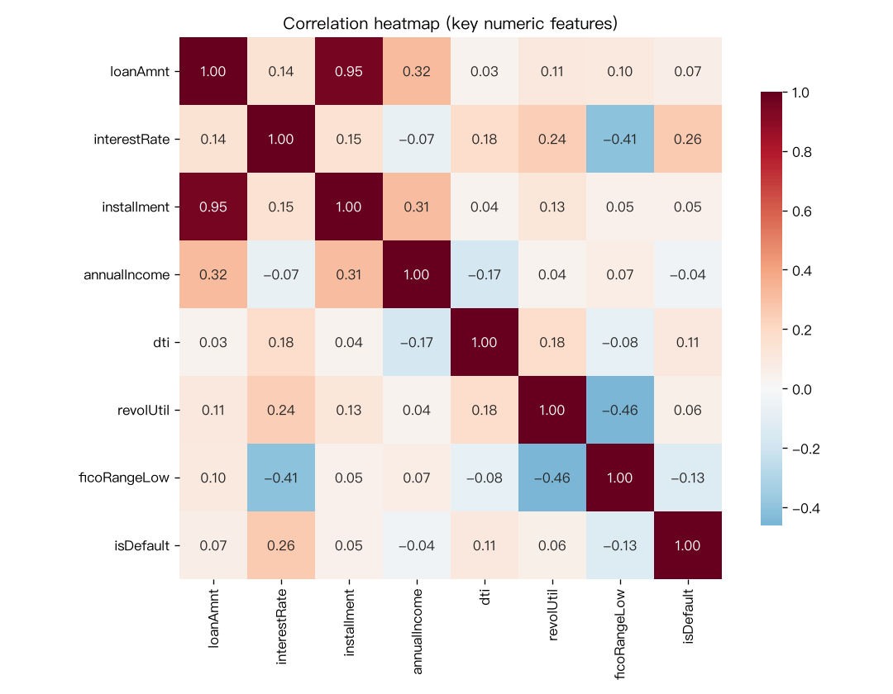

# W1 周报（2026/8/31 – 9/6）

老师好，以下是本周工作总结。W1 的目标是"读懂数据、备好数据"：完成了环境搭建、数据加载与业务理解、数据清洗与探索性分析（EDA）。核心结论：数据整体质量良好（仅删 0.19%），违约约占 20%，grade 等级是最强风险信号；下周进入特征工程与三模型基线建模。

**本周分析思路**（后面各节按此展开）：
1. 先定义业务问题：预测谁违约、给谁用（贷前风控）；
2. 给数据做体检：加载后先看列结构、缺失、id 重复、目标分布；
3. 再清洗，坚持"先检测、后处理"：把可疑值归入三类问题（不可能值 / 缺失 / 真实极端值），每类走统一的处理通道，每步可复现；
4. 然后做 EDA：围绕业务假设逐项看图——目标是否均衡、机构评级是否有效、违约组长什么样、分布是否适合直接入模、变量间线性信号多强；
5. 最后把发现翻译成 W2 的建模要点。

## 一、本周做了什么

### 1. 环境与数据准备
- 环境：新建 Python 虚拟环境并安装全部依赖（含 xgboost），细节与踩坑记录见《环境配置文档》。
- 数据：阿里天池信贷违约数据集，train 800,000 行 × 47 列，testA 200,000 行 × 46 列。testA 不含目标列 `isDefault`，用于最终模拟"真实预测"。字段按业务分四类：合同类、信用资质类、历史行为类、匿名行为特征 n0–n14（官方未公布含义，暂作黑箱特征）。

### 2. 业务理解：预测什么、给谁用
- 目标：借款人是否会违约（`isDefault`：0 = 正常还款，1 = 违约）。
- 场景：贷前风控——放款前识别高风险客户，把"事后亏钱"变成"事前识别"。

### 3. 数据清洗：先检测、后处理
思路：先判断可疑值属于哪类问题，再决定怎么处理——三类问题走三条通道：
1. **逻辑上不可能的值**（收入≤0、利用率>100%、dti 越界）→ 业务规则直接定性：视为缺失 / 封顶 / 删除；
2. **缺失值** → 按量级处理：极少缺失删行、成片缺失（n0–n14）填中位数、类别缺失填"未知"（先补后删、能补不删）；
3. **真实但极端的值**（3σ / IQR 点名的"离群点"）→ 统计只负责点名，是否处理靠业务核实：极端样本跨列自洽 + 长尾连续成串 = 真实极端客户，保留。

执行结果：收入=0 视为缺失 229 个、利用率>100% 封顶 2,719 个、dti 越界删 325 行、极少缺失删 1,177 行、匿名特征约 62 万格填中位数、就业年限 46,375 个填"未知"；installment 另做等额本息跨列验算，98.64% 与理论月供完全一致，确认为可靠派生值。收尾校验：id 重复 0、fico 上下限倒挂 0、剩余缺失格 0。train 共删 1,502 行（0.19%），代表性不受影响。

> 图 1｜六列关键数值变量的箱线图：极端值均为长尾分布的真实值（高收入、高利率档），非错误数据

> 图 2｜收入与月供的极端值长尾连续成串、逐级升高，判定为真实业务极端客户而非孤立录错

### 4. EDA 关键发现

#### 4.1 类别不平衡：违约约占 20%
**先看目标变量本身**：建模要预测的是"少数违约"群体，必须先量化它有多少数，否则后面选评估指标会走错方向。违约 159,287 人（20.0%）、正常 639,211 人（80.0%）——每 5 个借款人约 1 个违约。全猜"正常"也有 80% 准确率，因此 W2 评估以 F1 / AUC 为主，不能只看准确率。

> 图 3｜违约占比约 20%，典型少数类场景

#### 4.2 grade 等级是最强风险分层信号
**再看机构自己的风险评级是否可信**：grade 是放款时评定的风险分层，若它和实际违约率单调对应，说明等级体系真实有效且浓缩了大量风险信息。结果 A 级违约率 6.0% 单调上升到 G 级 49.7%——等级本身是建模的"头号种子特征"；35 个子级（subGrade）可能含更多信息。

> 图 4｜等级 A→G 违约率单调上升：头号风险分层变量

#### 4.3 违约组 vs 正常组画像
**"违约的人长什么样"**：把违约组与正常组的特征均值逐一对比，既验证业务直觉（高风险客户应收入更低、负债更重），也沉淀一幅能讲给业务方听的画像。结果：违约组利率更高（15.7% vs 12.6%，风险溢价）、收入更低（7.0 万 vs 7.8 万）、债务负担更重（dti 20.1 vs 17.7）、循环利用率更高、FICO 更低——画像与业务直觉一致。

> 图 5｜违约组在利率、收入、负债、信用分上整体劣于正常组

#### 4.4 数值分布：金额类变量严重右偏
**检查分布是否适合直接进模型**：金额类变量常见"少数人极高"的右偏，极端值会拉偏线性模型，先确认形态再决定要不要变换。结果：收入等变量少数人极高（均值 7.6 万 vs 中位数 6.5 万，最高 1,099 万），原始刻度下图几乎不可读；log 变换后近似钟形，W2 将对收入做 log 变换（或缩尾对照）。

> 图 6｜关键数值列分布：金额/账户类变量右偏明显

> 图 7｜收入 log10 后近似钟形：W2 特征变换的依据

#### 4.5 相关性：单变量线性信号偏弱
**量化单变量线性信号有多强**：为 W2 选模型提供依据——若每个变量与违约的相关性都很弱，说明关系偏非线性，树模型会更占优。结果：利率与违约相关性最强（+0.26），其次 FICO（−0.13）、dti（+0.11），方向均符合业务直觉；绝对值普遍不高，说明关系偏非线性——这是 W2 同时上线性模型与树模型的原因。

> 图 8｜关键数值特征相关性整体偏弱，需树模型捕捉非线性关系

## 二、对建模的启示
1. 类别不平衡 → 评估用 F1 / AUC，模型可加 class_weight；
2. grade 强特征 → W2 编码保留有序层级（含 subGrade）；
3. 关系偏非线性 → 逻辑回归作线性基准，随机森林 / XGBoost 预期表现更好；
4. 收入严重右偏 → W2 做 log 变换与缩尾对照实验。

## 三、下周计划（W2：特征工程与基线建模）
1. 特征工程：类别编码（grade/subGrade 有序处理）、数值标准化、log 变换、特征创建与选择；
2. 数据划分：训练 70% / 验证 20% / 测试 10%；
3. 基线建模：逻辑回归、随机森林、XGBoost 三模型训练；
4. 模型评估：F1 / AUC-ROC / PR 曲线 / 混淆矩阵，重点处理类别不平衡；
5. 交付物：特征工程代码、特征重要性分析、模型训练代码、验证集性能对比表。

## 四、遇到的问题与解决
1. macOS 下 xgboost 导入失败 → 安装 OpenMP 运行时（brew install libomp）解决；
2. 类别不平衡（违约约 20%）→ 评估指标以 F1 / AUC 为主；
3. 收入右偏（最高 1,099 万）→ 计划 log 变换；
4. 3σ / IQR 检测出大量"离群点" → 通过极端样本画像与长尾检查判定为真实极端值，保留。

本周详细的数据探索过程、异常值三层检验与全部图表见《数据探索+EDA可视化报告》，代码与产物见交付压缩包。如有问题请老师指正，谢谢！
