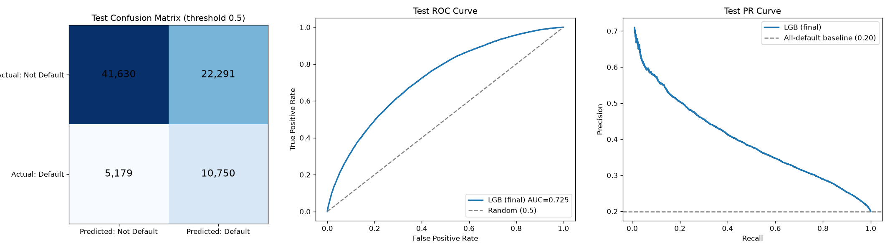
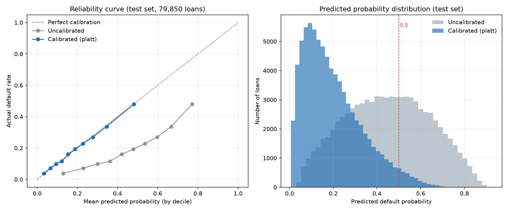
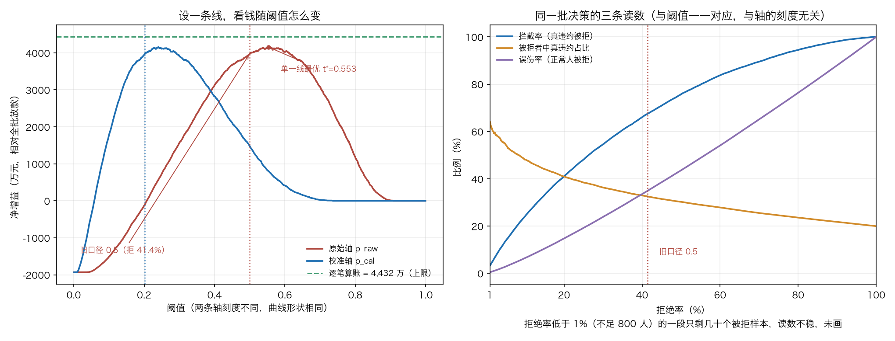
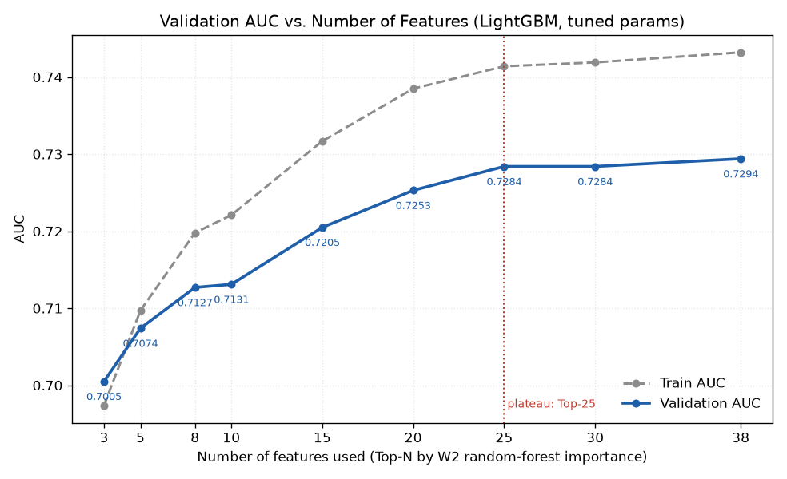

# W4 周报（2026/9/21 – 9/27）

老师好，以下是本周工作总结。W4 是收尾周，任务是把前三周训好的模型落到业务决策上。本周完成了六件事：解封 10% 测试集做最终评估与泛化能力分析、把概率校准到可以直接乘金额、重画审批线（放贷方案① 单线扫描、方案② 逐笔期望定线）、验证 38 个特征是否都用得上、补三项上线前必做的检查（名单头部区分度、时间外验证、人工复审带）、把全部结论整合成最终报告与可交互仪表板。内容截至 9/24。

本周核心结论：模型在从未参与任何建模决策的 79,850 人测试集上 AUC 0.7249、KS 0.3269，训练集与测试集只差 0.018，没有过拟合迹象。名单头部比整体更有用：分数最高的 10% 抓到 24.1% 的违约者，是随机挑的 2.41 倍，前 30% 抓到 54.6%。模型输出的概率原本整体虚高（平均 0.4495，而实际违约率只有 0.1995），经 Platt 校准后平均概率 0.1993，与真实违约率几乎重合，AUC 保持不变——校准只修正刻度，不改变排序。有了可信概率，审批线改成按每笔贷款的账来定：单一条线的最优点在 0.553（期望利润 6,344 万元），本批数据只有 3 年期与 5 年期两种贷款，按期限拆成两条线（3 年期 0.50、5 年期 0.62）能到 6,611 万元，比最优单线多 267 万元。按放款日期做时间外验证，AUC 0.7279 降到 0.7184，排序能力没垮，但违约率从 19.9% 升到 22.3%，概率轴需要定期重标定。特征数量实验显示 Top-25 之后 AUC 基本不再提升，字段采集量可以砍掉约三分之一。

本周分析思路：先用封存到最后的测试集给模型一个最终成绩，并对比训练/验证/测试三集看有没有过拟合 → 发现排序能力可用但概率数值不可信，做概率校准 → 有了可信概率，先把阈值扫成一条完整的"阈值 → 钱"曲线（放贷方案① 单线扫描），再用期望损失框架给每笔贷款各算一笔账（放贷方案② 逐笔定线），两种做法放在同一把尺子上比 → 验证 38 个特征是否都用得上 → 把结论做成可交互仪表板，并整合进最终报告与演示 PPT。

## 1. W4 要解决的问题：模型给的是概率，业务要的是决策

W1–W3 交付的模型只回答一个问题：这个人违约的概率有多大。业务方真正要拍板的是：这笔钱放还是不放。中间隔着两道坎。

第一道坎是概率本身不能信。训练时为应对类别不平衡（违约率 20%）加了类别权重，模型因此把概率整体说重了：在测试集上它给所有人的平均违约概率是 0.4495，而实际违约率只有 0.1995，虚高约 125%。排序是对的（坏人确实排在前面），但数值刻度整体膨胀了两倍多。

第二道坎是拿着概率也不知道线该划在哪。业务方习惯用 0.5 当分界线，但 0.5 只是数学默认值，从未按钱算过。同样 30% 的违约概率，5 年期的贷款赚头比 3 年期厚，敢接的风险就更高，线该画的位置不一样——固定阈值把所有贷款当成同一笔账。

## 2. 测试集最终评估：解封最后 10%

前 10% 的测试集（79,850 人）从 W2 起一直封存，没有参与过任何建模决策。本周先用它复测验证集成绩（与 W3 的 LGB 行完全一致，证明切分无偏差），再出最终成绩单。阈值 0.5 下：

| accuracy | precision | recall | F1 | AUC |
|---|---|---|---|---|
| 0.6560 | 0.3254 | 0.6749 | 0.4390 | 0.7249 |

在 79,850 人中，模型判"违约"约 3.3 万人，其中约 1.08 万人真违约（精确率 0.325）；真违约的 1.6 万人中抓到约 1.08 万（召回率 0.675）。误伤好人是这类"抓坏人"任务的固有代价，需要靠人工复审消化，这一点在后面的业务建议里占了重要位置。

ROC 曲线远离对角线，排序能力明显强于随机（0.5）；PR 曲线明显高于"全猜违约"的基准线（0.20），抓违约者的效率远好于无脑全猜。

## 3. 泛化能力：训练/验证/测试三集对比

| 数据集 | 准确率 | 精确率 | 召回率 | F1 | AUC |
|---|---|---|---|---|---|
| 训练（558,948） | 0.6633 | 0.3352 | 0.6999 | 0.4533 | 0.7432 |
| 验证（159,700） | 0.6566 | 0.3271 | 0.6825 | 0.4422 | 0.7294 |
| 测试（79,850） | 0.6560 | 0.3254 | 0.6749 | 0.4390 | 0.7249 |

**泛化结论**：训练集 AUC 只比测试集高 0.018（0.7432 vs 0.7249），三集指标几乎贴着走，模型没有明显过拟合，学的是真实规律而非背题；验证集结论能原样搬到测试集，调参没有泄漏进测试集。

学习曲线（按 1 万 → 55.9 万逐步扩大训练集重训）印证了同一件事：训练集 AUC 从 0.9898 一路降到 0.7432，验证集 AUC 则从 0.6961 稳步升到 0.7292，两条线在 40 万样本后基本收口。说明当前模型容量与数据量是匹配的，加数据收益有限，性能瓶颈在特征信息量而不在样本量。

## 4. 概率校准：让概率可以直接乘金额

做法是找一个单调映射，把模型输出翻译成真实违约率。两种主流方法先在验证集内部对半比较（一半拟合、一半用 Brier 分数评分），选定后再应用到测试集，测试集全程不参与拟合。结果 Isotonic 的 Brier 是 0.14193，Platt 是 0.14183，只差在小数点后第四位，选了参数更少、小样本下更稳的 Platt；选定后在验证集全量上重新拟合，再套到测试集。

| 方案 | Brier（概率误差，越小越好） | AUC | 平均预测概率 |
|---|---|---|---|
| 未校准 | 0.2106 | 0.7249 | 0.4495 |
| Isotonic（对照） | 0.1425 | 0.7248 | 0.1993 |
| **Platt（采用）** | **0.1424** | 0.7249 | **0.1993** |
| （参考：实际违约率） | — | — | 0.1995 |

三个读数：平均概率从 0.4495 压到 0.1993，与实际违约率 0.1995 几乎完全一致；概率预测误差（Brier）降了 32%；AUC 一点没变，因为校准是单调变换，不改变排序。AUC 没变不是校准失效，是预期行为——排序能力本来就够，缺的是刻度。

这里要澄清一个容易记错的点：**校准并没有让"0.5 这条线"失效。** 校准是严格单调的（按原始概率排序后校准概率下降 0 次，Spearman 相关系数 1.0000000000），所以原始概率上的 `p_raw ≥ 0.5` 与校准轴上的 `p_cal ≥ 0.202` 给出的是**逐行完全相同的拒绝名单**（都是 33,041 人，41.4%）。全局阈值策略在两条轴上一一对应，用一个单调变换改变不了可实现的决策集合。真正的事实是：0.5 这个数从来就不是业务最优线，这一点在下一节用钱算清楚了。

## 5. 放贷方案① 单线扫描：一条线管所有人

业务方要拍板的只有一件事：这笔钱放还是不放。落到模型上，最省事的做法是一条阈值线：概率过线就拒——只认排序，一条线管所有人，换个客群也照搬得过来；代价是金额、期限、利率都不进规则。W3 周报承诺过 W4 会给不同阈值的对照表，本周补成了完整曲线（0 到 1 按 0.001 步长扫一遍），拒绝率和钱一起给：

| 切法 | 拒绝率 | 总期望利润 |
|---|---|---|
| 全放（不筛选） | 0% | 2,085 万元 |
| 单一线 · 旧口径 0.5 | 41.4% | 6,155 万元 |
| 单一线 · 真正最优 t\*=0.553 | 32.2% | 6,344 万元 |
| 单一线 · 验证集选出的 t=0.560（口径更干净） | 30.9% | 6,342 万元 |
| 拆线 · 方案②（3 年期 0.50 / 5 年期 0.62） | 35.2% | 6,611 万元 |

三个读数：

· **0.5 这个数拍偏了，跟概率校准无关**：0.5 比最优单一线少赚 189 万元。《模型评估报告》里早就写过"0.5 是数学默认值，不是业务最优值"，这一周拿钱把它算实了。

· **选阈值的口径要交代清楚**：t\*=0.553 是在**测试集**上扫出来的，等于拿测试集选参数，收益会偏乐观。另用"验证集选线、测试集只跑一次"的口径复核（`scripts/W4/threshold_select_on_val.py`）：验证集选出的最优阈值是 0.560，拿到测试集只跑一次，拒绝 30.9%、期望利润 6,342 万元、比 0.5 多 187 万元，与测试集细扫的最优点只差 2 万元，说明这不是调参调出来的。验证集上 0.54–0.58 是一段平台区（利润都在最优值 99.5% 以内），业务在这段里按风险偏好挑都可以。

· **两个口径的绝对值不相等，看数时别串**：0.553 处按净增益（回看）算是比全放多 4,157 万元，换成期望口径是 4,259 万元（6,344 − 2,085）。差的 102 万元来自被拒的这批人实际违约率 35.5%，比模型估的 36.0% 略低。线上没有答案，落地只用期望口径。

顺带产出一张等效阈值对照表，方便业务方在校准后的分数上沿用旧口径：想切出 41.4% 的拒绝率，原始轴上设 0.500，校准轴上设 0.202；想切 30%，两边分别是 0.566 与 0.251。

单一线再优化也只到 6,344 万元：它只能决定"拒多少人"，管不了被拒的是谁。要再往上走，得换算法。

## 6. 放贷方案② 逐笔期望定线：按期限拆两条线

方案②换掉"一刀切"的算法，给每笔贷款各算一笔账（`scripts/W4/expected_loss_framework.py`）：

**每 1 元贷款的期望利润 =（1 − p）× 净收益率 × 期限 − p ×（1 − 回收率）**

其中 p 用校准后的概率，期望利润 > 0 就批准。同一个测试集上，几种切法放在一张表里比：

| 策略 | 被拒占比 | 拦截率（真违约被拒） | 被拒者中真违约占比 | 总期望利润 |
|---|---|---|---|---|
| 全放（不筛选） | 0% | 0% | — | 2,085 万元 |
| 固定阈值 0.5 | 41.4% | 67.5% | 32.5% | 6,155 万元 |
| 期望损失框架 · 利息全额（最乐观） | 1.8% | 4.6% | 52.4% | 2,670 万元 |
| **期望损失框架 · 净息差 6%（中性，推荐）** | **35.2%** | **59.8%** | **33.9%** | **6,611 万元** |
| 期望损失框架 · 净息差 3%（最保守） | 65.3% | 86.4% | 26.4% | 4,983 万元 |
| 期望损失框架（未校准概率，对照） | 87.7% | 97.4% | 22.2% | 2,110 万元 |

四个读数：

· **中性口径下"少拒多赚"**：拒绝 35.2%（低于固定阈值的 41.4%），期望利润反而更高（6,611 vs 6,155 万元，多 456 万元）。框架不要求"多抓坏人"，只要求每笔账为正，主动放过那些利息收入能覆盖预期损失的高风险客户。

· **在本批数据上落地成两条线**：数据里只有 3 年期与 5 年期两种贷款，按期限各给一条（3 年期 ≥ 0.50 拒、5 年期 ≥ 0.62 拒，模型原始输出轴），拒绝 28,078 人（35.2%），期望利润 6,611 万元，比最优单一线多 267 万元。这不是巧合：中性口径把净息差统一按 6% 算，金额在公式两边同时出现不改变判定，利率也被这个统一值吸收，真正让每笔线不同的只有期限。代价是审批系统要按期限出两张评分表。

· **收益口径是最大的敏感源**：同样的框架，收益假设从"利息全赚"换成"净息差 3%"，拒绝率从 1.8% 涨到 65.3%。最终切割线必须由机构真实财务口径决定，不能拍脑袋。净收益率和回收率这两列数据集里都没有，6% 和 30% 是演示假设——这套框架的价值在方法（把放贷决策从排名变成算账），数字要等真实口径重算。

· **校准是前提**：不校准概率直接套框架，拒绝率会虚高到 87.7%，每一笔账都算错。

那 267 万元由两组换人组成：② 把 ① 拒掉的 2,809 笔（平均利率 15.7%，全部 5 年期）放进来，贡献 +171.5 万元；把 ① 会放的 5,194 笔（平均利率 14.5%，全部 3 年期）改判为拒，避开 −95.9 万元。要和改造成本比，换算到业务规模：每 100 亿元年放款额，中性口径下 ② 比 ① 每年多约 2,319 万元，净息差压到 3% 时约 787 万元；这个数高过"一次性改造费 ÷ 摊销年限 + 年运维费"一个量级就值得改。

## 6b 补充分析：名单头部、时间外验证与人工复审带

这三件事原先都不在报告里，也都是上线前会被问到的问题。

**名单头部区分度**（`scripts/W4/head_capture.py`）。AUC 在整批人上算平均，看不出最危险的那一小撮有没有被抓住。补两个只看排序的指标：KS = 0.3269（风控常用的门槛是 0.30），以及头部捕获率：

| 分数最高的 | 人数 | 抓到违约者 | 捕获率 | 相对随机 | 这批人自己的违约率 |
|---|---|---|---|---|---|
| 前 5% | 3,992 | 2,174 | 13.6% | 2.73 倍 | 54.5% |
| 前 10% | 7,985 | 3,839 | 24.1% | 2.41 倍 | 48.1% |
| 前 20% | 15,970 | 6,535 | 41.0% | 2.05 倍 | 40.9% |
| 前 30% | 23,955 | 8,693 | 54.6% | 1.82 倍 | 36.3% |

前 10% 的 7,985 人里近一半真的违约，是整体违约率 19.9% 的 2.4 倍。这份名单头部就是审核人力的投放顺序。

**时间外验证**（`scripts/W4/oot_validation.py`）。前面的成绩都出自随机切分：同一批放款随机分成两半，两边行情一样，成绩偏乐观。按放款日期再切一次，训练用 2016 年底之前的 664,968 笔，测试用 2017-01 到 2018-06 的 124,550 笔；2018-07 之后的 8,980 笔因暴露期不足剔除。

| 口径 | 违约率 | AUC | KS | 前 10% 捕获率 | 阈值 0.5 拒绝率 |
|---|---|---|---|---|---|
| 随机切分（对照） | 19.9% | 0.7279 | 0.3300 | 24.1% | 41.9% |
| 时间外（2017-01 起） | 22.3% | 0.7184 | 0.3190 | 21.7% | 43.9% |

排序能力掉了一点，没伤到根。行情那一层的漂移要单独盯：违约率高 2.3 个百分点，同一条 0.5 的线拒人比例升 2.0 个百分点；时间外测试集按十分位分箱，每一箱的预测概率都高于实际违约率（最低一箱预测 0.120、实际 0.038）。概率轴要定期用最近到期的贷款重标定，只看排序的阈值不用动。

**人工复审带**（`scripts/W4/review_band.py`，放贷方案② 的执行细节）。拆线方案里，卡在线上的人模型自己也没把握。把线上方 20% 以内（校准轴 3 年期 0.2045–0.2455、5 年期 0.3000–0.3600）划成人工复审带：

| 分工 | 人数 | 占测试集 | 实际违约率 |
|---|---|---|---|
| 直接放行 | 51,772 | 64.8% | 12.4% |
| 人工复审 | 8,697 | 10.9% | 25.4% |
| 直接拒绝 | 19,381 | 24.3% | 37.8% |

复审带的违约率落在放行段与直接拒段中间（模型预估 25.9%，事后实际 25.4%），占被拒 28,078 人的 31.0%，里面 6,488 名是正常客户。这撮人全放，期望利润 −295 万元；把里面的正常人挑出来放，则是 2,188 万元息差——复审带的价值就在这两头之间，判错的代价有上限。带宽放宽到 30%，复审人数涨到 12,381。

## 7. 特征数量实验：38 个特征是否都用得上

特征越多，上线成本越高：要多采集字段、多维护数据管道、多解释。本周按 W2 随机森林重要性从高到低排队，逐步加特征重训，看验证集 AUC 怎么变。

| 用前 N 个特征 | 验证集 AUC | 达到满血的比例 |
|---|---|---|
| Top-3 | 0.7005 | 96.0% |
| Top-5 | 0.7074 | 97.0% |
| Top-10 | 0.7131 | 97.8% |
| Top-15 | 0.7205 | 98.8% |
| Top-20 | 0.7253 | 99.4% |
| Top-25 | 0.7284 | 99.9% |
| Top-30 | 0.7284 | 99.9% |
| Top-38 | 0.7294 | 100% |

前 3 个特征就吃掉了 96% 的性能（子等级、利率、等级）；25 个之后基本饱和，从 25 加到 38，AUC 只涨 0.001。想省成本，砍到 20–25 个是划算的，损失 0.001–0.004 的 AUC，能换掉约三分之一的字段维护量。需要注意这是"按重要性排序"的实验结论，并不等于随便挑 20 个都行。

## 8. 业务仪表板：给业务方的阈值模拟器

`outputs/W4/dashboard.html`（单文件、离线可开），四个页签：① 数据概览 ② 模型表现（成绩单与 KS、头部捕获率、泛化、性能图、时间外验证、模型对比、特征重要性、调参、特征数量）③ 放贷方案① 单一线 ④ 放贷方案② 拆线：按期限设两条线。页签③ 是阈值模拟器，拖动审批阈值滑块，拒绝率、精确率、召回率、拦截人数实时重算，下面同步给出"避免坏账 / 放弃收入 / 净增益"三笔账，回收率和净息差两个参数也能拖。页签④ 收的是本周的主结论：概率校准、分箱对照、逐笔算账、和 ③ 的区别、敏感性滑块与对照表、两条线对比、人工复审带、上线清单。滑块默认值统一成回收率 30%、净息差 6%，与报告口径一致。

## 9. 业务解读要点

· **模型定位是排序初筛加辅助人工审核**，AUC 0.725 还不足以支撑全自动放款；把违约概率从高到低排序，审核人力优先投入中间分数段。

· **第一道防线看贷款条件**：子等级、期限、等级、利率、FICO 是模型最看重的信息，风控规则可以围绕这几个字段设硬性门槛（比如特定等级加高利率的组合直接降额）。

· **审批线不要用 0.5**：中性口径（净息差 6%、回收率 30%）下把候选线扫了一遍，起手线建议 **0.55**：拒绝 32.7%、净增益 4,144 万元、期望利润 6,340 万元，比 0.5（净增益 3,980 万元、期望利润 6,155 万元）分别多 164 万元和 185 万元。改用验证集选线，0.560 对应 6,342 万元，平台区 0.54–0.58。审批系统能拆线就按期限设两条（3 年期 0.50、5 年期 0.62），上限 6,611 万元；上线节奏两步走，先用 0.55 把单线跑起来，财务口径与审批系统改造到位后再切两条线。落地形态推荐三段：线以下直接放、线上方 20% 以内的 8,697 人交人工复审、更上面的直接拒。

· **精确率的代价要提前配资源**：阈值 0.5 下被判违约的人里约三分之一是真违约，三分之二是误伤；复审带把这部分人圈出来（8,697 人），里面 6,488 名是正常客户。这撮人全放期望利润 −295 万元，把里面的正常人挑出来放则是 2,188 万元息差——复审带的价值就在这两头之间，转人工就是把它往好的那头拉。

· **概率可以直接算钱了**：校准之后模型给出的违约概率就是违约率的真实估计，可以直接乘贷款金额算期望利润，这是后续所有金额决策的基础。上线后这一层要定期重标定，时间外验证显示概率刻度会随行情漂移。

## 10. 局限与改进方向

| 局限 | 说明 | 改进方向 |
|---|---|---|
| 违约率 20% 偏高 | 样本违约率明显高于真实客群（通常低于 5%），概率标度已用 Platt 校准修正，迁移到真实客群仍需真实数据 | 用真实客群数据重训并重新校准 |
| 匿名特征不可解释 | n0–n14 有信号但无业务含义，无法向监管解释 | 与数据提供方确认口径，或用可解释特征替代 |
| 时间维度只切了一刀 | 已补一次时间外验证（6b 节），AUC 0.7279 → 0.7184，但只有一个切分点 | 按月滚动 walk-forward，长期监控 AUC 与 KS 衰减 |
| 金额结论依赖模拟参数 | 净息差 6%、回收率 30% 是模拟值，数据集里没有这两列 | 上线前与财务确认口径，用真实值重算全部金额 |
| testA 无标签 | 线上集无法直接评估，最终评估用的是自切测试集 | 争取带标签的新数据做线上验证 |
| 精确率有限 | 阈值 0.5 下误伤较多 | 结合人工审核流程、分层阈值策略，而非单纯提高模型 |
| 集成提升有限 | 队员同质（三个树模型），互补空间小 | 引入线性或深度模型等异质基学习器，或做特征多样性 |

## 11. 交付物清单

| 交付物 | 位置 |
|---|---|
| 最终项目报告（含业务建议） | `reports/W4/最终项目报告.md` + `.docx` |
| 业务仪表板（单文件，可离线打开） | `outputs/W4/dashboard.html`（四个页签，③ 放贷方案①、④ 放贷方案②） |
| 演示 PPT（15 页，无备注） | `outputs/W4/信贷违约模型与审批线_W4汇报.pptx` 与同名 `.pdf`；旧版已移到 `outputs/W4/archive/` |
| 全流程复现 Notebook | `notebooks/main_pipeline.ipynb` |
| W4 代码 | `scripts/W4/`（最终评估、概率校准、期望损失框架、特征数量、阈值金额扫描、验证集选阈值、头部区分度、时间外验证、复审带、仪表板脚本） |
| 项目说明与依赖 | `README.md`、`requirements.txt` |

## 12. 问题与解决

· 问题一：概率数值不可信（平均预测 0.4495 vs 实际 0.1995）。解决：在验证集内部对半比较两种校准方法，选定 Platt 后在全量验证集上重新拟合再套用测试集，测试集全程不参与拟合；校准后平均概率 0.1993，几乎完全贴合实际。

· 问题二：期望损失框架的参数（净收益率、回收率）数据集里没有，结论会不会站不住。解决：不回避参数假设，改为把参数依赖性本身当作结论交付——做 4 种收益口径 × 4 种回收率的敏感性分析，明确"收益口径是最大敏感源"，并在报告里写清这是演示性测算、不构成利润结论。

· 问题三：《模型评估报告》里写着"0.5 不是业务最优值"，但直到本周都没有拿钱算过它到底偏了多少。解决：把阈值从 0 到 1 按 0.001 步长扫了一遍，用同一把尺子（中性口径）比较各种切法，得到最优单一线在 0.553、比 0.5 多赚 189 万元，同时把"单一线最优"和"逐笔算账"的差距（267 万元）量化出来。

· 问题四：W3 承诺的"不同阈值的对照表"当时只有精确率/召回率，没有金额。解决：补齐阈值金额扫描（0 到 1、步长 0.001）、验证集选线口径与等效阈值对照表，全部写进报告 10.1 节与仪表板页签③。

· 问题五：随机切分的成绩会不会偏乐观、名单头部到底抓得怎么样、误伤的人怎么落地处理，这三件事此前都只有一句话带过。解决：做出头部捕获率与 KS、按放款日期的时间外验证、线上方 20% 的人工复审带，三块内容同时写进最终报告（9.1、9.6、10.3 节）与仪表板（页签② ④）。
