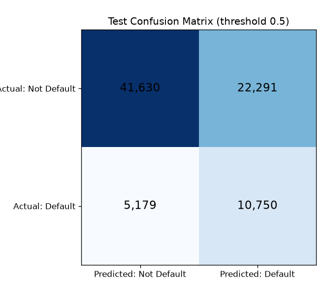
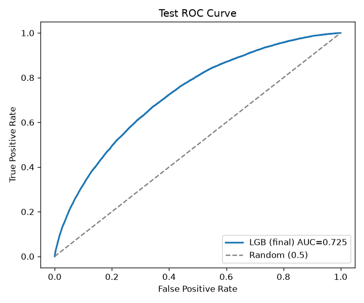
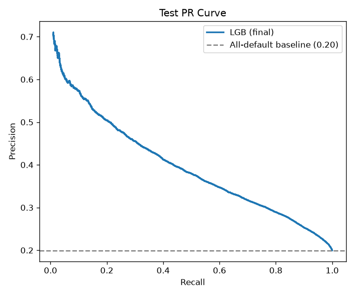
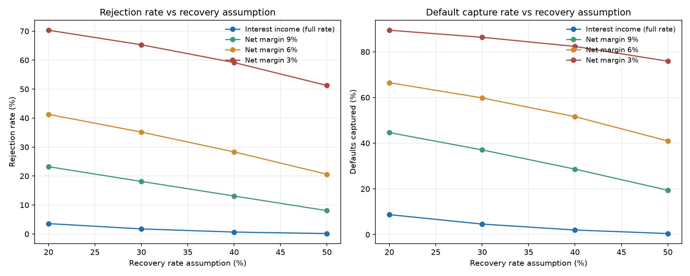

# 信贷违约预测项目 · 最终项目报告

**项目**：基于用户历史数据与行为特征的信贷违约预测模型
**作者**：王子安（阿里线上数据分析实习）
**周期**：2026/8/31 – 2026/9/27（W1–W4）
**数据**：阿里天池信贷违约数据集（train 80 万 / testA 20 万）
**文档版本**：v1.3（2026/9/17，新增 5.7 特征数量实验、9.5 概率校准）

---

## 摘要

- 我们用机器学习训练了一个"违约预警"模型：给每个借款人打一个 0–1 的违约概率，机构可用它把高风险客户排在前面，配合人工审核做风控。
- 最终模型（LightGBM 优化版）在从未见过的 10 万人测试集上 AUC = 0.725：随机抽一对"违约 vs 正常"客户，模型有 72.5% 的概率把违约者排在前面。
- 模型最看重的信息是**贷款条件本身**：子等级、期限、等级、利率、FICO 信用分排在前列——与业务直觉和探索阶段结论互相印证，结论稳健。
- 模型适合做**排序初筛 + 辅助人工审核**，不建议全自动放款；阈值可按机构"严审 vs 宽进"目标调整（报告第 10 节给出对照表）。

---

## 1. 项目概述与业务问题

### 1.1 业务背景

金融科技行业快速发展，信贷业务是核心业务之一，但面临着日益增长的风险管理挑战。传统信贷审批依赖人工经验和规则判断，效率有限，也难以应对复杂多变的信用风险。本项目目标是：**利用借款人的历史数据与行为特征，预测其违约概率，为金融机构的风控决策提供数据支持**。

### 1.2 要解决什么问题

把"事后亏钱"变成"事前识别"：机构在放款前，用模型判断一个借款人有多大概率的还不上钱，从而——

- 拒绝或延缓高风险客户；
- 给低风险客户更优的利率与额度（差异化定价）；
- 把有限的审核人力集中在"模型拿不准"的中间人群。

### 1.3 建模任务定义

- **预测目标**：`isDefault`（0 = 正常还款，1 = 违约）。
- **问题类型**：二分类监督学习（预测"是否违约"），并输出违约概率。
- **评估立场**：由于违约客户只占 20%（类别不平衡），全程以**精确率 / 召回率 / F1 / AUC** 为主要指标，准确率仅作参考。

---

## 2. 数据说明

### 2.1 数据来源与规模

| 数据集 | 原始 | 清洗后 | 说明 |
|---|---|---|---|
| train.csv | 800,000 行 × 47 列 | 798,498 行 × 47 列 | 含目标变量 `isDefault`，用于训练与验证 |
| testA.csv | 200,000 行 × 46 列 | 199,623 行 × 46 列 | 无 `isDefault`，仅用于结构校验 |

**重要说明**：testA 是比赛用的"线上预测集"，没有违约标签，无法直接评估模型。因此本项目按任务文档要求，**从 train 中切出 10%（79,850 人）作为测试集**，从头到尾不参与任何建模决策，用于最终评估；testA 仅用于验证训练集分布可外推。

### 2.2 字段分类（47 列）

| 类别 | 字段 | 业务含义 |
|---|---|---|
| 身份/合同 | id、loanAmnt、term、interestRate、installment | 贷款金额、期限、利率、月供 |
| 信用资质 | grade、subGrade、fico、dti、annualIncome、homeOwnership | 等级、信用分、负债收入比、收入、房产 |
| 历史行为 | delinquency_2years、openAcc、revolUtil、totalAcc 等 | 逾期史、账户数、额度使用率 |
| 地区/申请 | regionCode、purpose、applicationType、issueDate 等 | 地区、用途、申请类型、时间 |
| 匿名特征 | n0–n14（15 个） | 行为计数特征的脱敏处理，**含义未公布**，只能黑箱使用 |

### 2.3 目标变量分布（类别不平衡，重点）

- 正常还款：639,211 人（80.0%）
- 违约：159,287 人（20.0%）

每 5 个借款人里约 1 个违约。这种不平衡意味着：全猜"正常"也能有 80% 准确率，却一个违约客户都抓不到，所以**评估必须看精确率/召回率/F1/AUC**（详见第 6 节）。

---

## 3. 数据预处理与质量控制

遵循"**先检测、后处理**、能补不删"原则：先跑异常值检测报告，再依据结论执行清洗。完整日志见 `outputs/W1/outlier_report.txt`。

### 3.1 处理决策表

| 问题类型 | 发现（train） | 处理方式 | 理由 |
|---|---|---|---|
| 年收入为 0 | 229 个 | 视为缺失并填充 | 逻辑上不可能，属记录错误 |
| 循环利用率 >100% | 2,719 个 | 封顶到 100 | 保留样本信息，只修正越界 |
| dti 越界（<0 或 >100） | 325 行 | 删除 | 脏数据 |
| 缺失极少列（title 等） | 1,177 行 | 删除 | 占比 <0.15%，删行无影响 |
| 匿名特征 n0–n14 缺失 | 约 40 万格（约 5%/列） | 中位数填充 | 防止大量删行 |
| 就业年限缺失 | 46,375 个 | 填"未知"类别 | 保留为有效取值 |
| id 重复 / fico 上下限倒挂 | 0 | — | 数据本身一致 |

### 3.2 异常值三层验证（为什么"抓到了却不删"）

箱线图/IQR 与 3σ 检测抓到的极端值（高收入、高余额等），经三层检验确认为**真实业务极端客户**：① 业务规则已先排除不可能的值；② 极端样本画像跨列自洽（收入最高者的 FICO、dti 均正常）；③ 极端值呈连续长尾而非孤立跳变。因此**保留不删**，后续用 log 变换压缩其影响。

### 3.3 清洗结果

- 行数：800,000 → **798,498**（仅删 0.19%，样本量完整保留——清洗修的是"格子质量"，不是砍样本）。
- 列数：47 列（清洗阶段不变，特征选择在 W2 完成）。
- 成果：无缺失、无矛盾、无越界，数据可直接进入特征工程。

---

## 4. 探索性数据分析（EDA）

图见 `outputs/W1/eda_*.png`，关键发现四条，全部被后续建模印证。

### 4.1 信用等级是违约率最强的分层变量


| grade | 样本数 | 违约率 |
|---|---|---|
| A | 139,462 | 6.0% |
| B | 233,330 | 13.3% |
| C | 226,664 | 22.5% |
| D | 119,162 | 30.4% |
| E | 55,527 | 38.4% |
| F | 19,004 | 45.3% |
| G | 5,349 | 49.7% |

A→G 违约率从 6% 单调升到近 50%——与计量里"分组均值随分组变量单调变化"是同一逻辑。**等级本身已浓缩大量风险信息**，是后续模型的"头号种子特征"。

### 4.2 违约组 vs 正常组：均值画像

| 特征 | 正常组 | 违约组 | 解读 |
|---|---|---|---|
| 利率 interestRate | 12.6% | 15.7% | 违约客户通常拿到更高利率（风险溢价） |
| 年收入 annualIncome | 77,641 | 70,277 | 违约组收入更低 |
| 债务收入比 dti | 17.7 | 20.1 | 违约组负债压力更大 |
| 循环利用率 revolUtil | 51.1% | 54.7% | 违约组更"刷爆"额度 |
| FICO 下限 | 698 | 688 | 违约组信用分更低 |

### 4.3 收入严重右偏 → 特征工程做 log 变换

`annualIncome` 均值 7.6 万 > 中位数 6.5 万，90% 人群收入 ≤12.5 万，但最大达 1,099 万。取 log 后分布接近钟形（图见 `outputs/W1/eda_income_log_compare.png`），因此 W2 对金额类变量统一 log 变换，避免超高收入者牵着模型走。

### 4.4 关系偏非线性

与违约的相关系数绝对值普遍不高（利率 +0.26 最强）——说明光靠线性相关解释不了全部，这是后续引入树模型（随机森林/XGBoost）的动机之一。

---

## 5. 特征工程

目标：把原始字段整理成模型"最吃得动"的输入，四步走：**编码 → 变换 → 创建 → 选择**。完整细节见 `reports/特征工程报告.md`。

### 5.1 类别编码

- 有序类别用**序数编码**：grade（1–7）、subGrade（1–35）、employmentLength（年限，未知=-1）。
- 无序类别用**独热编码**（drop_first=True，避免虚拟变量陷阱）：homeOwnership、verificationStatus、purpose。
- 高基数地区用**目标编码**（= 训练集该地区违约率），只从训练集学习，防泄漏。

### 5.2 数值变换

- 右偏金额列（贷款金额、月供、年收入、余额）做 `log1p` 变换。
- 连续数值列 z-score 标准化（均值/标准差只从训练集拟合）。

### 5.3 特征创建（每个新特征都有一句业务理由）

| 新特征 | 业务理由 |
|---|---|
| `fico_avg`（fico 上下限均值） | 同一评分的区间表示合并为一个值 |
| `credit_history_years`（信用历史长度，中位数 15 年） | 信用历史越长通常越可信 |
| `installment_income_ratio`（月供收入比） | 衡量"还不起"的压力 |
| `grade_dti_inter`、`interest_loan_inter`（2 个交互项） | 计量思想：高风险因素叠加，风险更高 |

### 5.4 特征选择（60 列 → 保留 38 个特征）

过滤法（与违约的相关系数）+ 嵌入法（随机森林特征重要性）交叉判断，删除"重要性 < 均值 1/10"的弱特征。被删的主要是独热编码产生的小类别列；`purpose` 的独热列**全部被删**，说明贷款用途单独看对违约预测贡献很小（已被利率、等级等特征吸收）——这是特征选择给出的客观结论。

**特征重要性 Top 5**（随机森林）：

| 特征 | 重要性 |
|---|---|
| subGrade_enc | 0.188 |
| interestRate | 0.134 |
| grade_enc | 0.109 |
| term | 0.069 |
| grade_dti_inter | 0.045 |

### 5.5 防数据泄漏（全程底线）

目标编码、标准化、缺失填充等一切"从数据学到的规则"**只从训练集学习、再套用到测试集**，保证测试集（以及未来的新客户）对模型是真正"没见过"的。若有泄漏，最终评估会虚高、实际业务会翻车。

### 5.6 方法取舍：文档里列了、我们评估后没用上的方法

任务文档在本阶段还列了另外几种方法。逐条评估后没有全部采用，理由如下——不是不了解，而是在这份数据上用了会更差、或收益配不上成本。

| 方法 | 为什么不用 |
|---|---|
| 最小最大归一化（MinMax） | 它用"最大值 − 最小值"当分母，对极端值极其敏感。收入最大 1,099 万，归一化后 99.9% 的人会被压到贴近 0 的一小段里，人群之间的差异等于被抹平——W1 讨论过"收入直方图远端柱子看不见"，MinMax 会把这个毛病直接带进模型。改用 log1p + z-score 后，既压缩了长尾，又保住了相对距离。 |
| 分箱（等频 / 等距切档） | 三条理由：① `grade`/`subGrade` 本身就是机构分好的风险档（A–G、1–35 子级），序数编码已经把这层分档信息喂给了模型；② 树模型每次分裂就是在自动寻找最优切分点，人工再分一遍是重复劳动，还可能切得比模型自己找的更差；③ 风控最经典的分箱技术是 WOE，而我们对 `regionCode` 用的**目标编码**（用该地区的历史违约率替代地区编号）属于同一族思路——用目标信息给类别赋值，这层思想已经用上了。 |
| 多项式特征（全量两两相乘） | 38 个特征两两组合会膨胀到 700 多个，在 56 万训练样本、20% 违约率下极易过拟合。改为**只造业务上最该交互的两组**：`grade × dti`、`interestRate × loanAmnt`，其中 `grade_dti_inter` 直接进了特征重要性 Top 5。树模型的分裂本身也能捕捉"高等级 + 高负债"这类组合条件，全量多项式属于重复投入。 |
| 包装法 RFE（递归特征消除） | 每轮训练一次模型、只丢掉一个特征，56 万行 × 38 特征跑一轮要几十分钟到几小时；而过滤法（与违约的相关系数）+ 嵌入法（随机森林重要性）两路交叉，已经把 60 列筛到 38 个。收益与成本不成比例，故不采用——5.7 节的特征数量实验用另一种更便宜的方式给出了同样的信息：Top 25 之后 AUC 几乎不再提升，RFE 想找的“最优特征数”答案，几条曲线就够回答。 |

**一句话总结**：方法的选择标准不是"文档里有没有写"，而是"这份数据、这个任务、这类模型需不需要"。以上四项不做，本身也是一个有依据的结论，而不是遗漏。

### 5.7 特征数量实验：38 个都用得上吗

上述筛选解决了"该不该留"，但业务方还会问第二个问题：**38 个特征是不是都得采集？少放几个会不会掉很多？**（字段越少，数据采集、清洗、线上部署的成本越低。）为此做一次"逐步加特征、每次重训同一个 LGB 模型"的实验：按 W2 随机森林重要性从高到低排序，依次只喂前 N 个特征，比较验证集 AUC。为避免污染最终评估，本实验**只看训练集与验证集，测试集全程不参与**。

| 使用特征数 | 训练集 AUC | 验证集 AUC | 相比满血模型的差距 |
|---|---|---|---|
| Top 3 | 0.6974 | 0.7005 | −0.0289 |
| Top 5 | 0.7097 | 0.7074 | −0.0220 |
| Top 8 | 0.7198 | 0.7127 | −0.0167 |
| Top 10 | 0.7221 | 0.7131 | −0.0163 |
| Top 15 | 0.7317 | 0.7205 | −0.0089 |
| Top 20 | 0.7385 | 0.7253 | −0.0041 |
| Top 25 | 0.7414 | 0.7284 | −0.0010 |
| Top 30 | 0.7419 | 0.7284 | −0.0010 |
| Top 38（最终模型） | 0.7432 | **0.7294** | — |


**怎么读这张图：**

- **3 个特征就拿到 96% 的性能**（0.7005 / 0.7294）。这 3 个是 `subGrade_enc`、`interestRate`、`grade_enc`——机构给出的风险等级、子级和利率，本身就是风控专业判断的浓缩，这也和 EDA 第 4.1 节"等级是最强分层变量"完全对上。
- **20 个特征时达到满血模型的 99.4%**（0.7253）；补齐剩下 18 个特征，只多换来 **+0.0041**。
- **25 个之后基本饱和**：25 → 30 验证 AUC 一点没涨，25 → 38 也只涨 0.0010。这条曲线是典型的"边际收益递减"：真正有用的信息集中在头 20 个特征里，后面的匿名行为特征（n0–n14 等）每人贡献千分之几。
- **训练集 AUC 一路涨到 0.7432，验证集却早早走平**，说明后加进去的特征更多是在帮模型"记熟训练集"，而不是学到新的泛化规律。这也是为什么不必把 60 列全塞进去、也是为什么不需要再做 RFE 逐轮筛选（结论已经在这里拿到了，成本却只要几分钟）。

**业务结论**：最终模型保留全部 38 个特征——它们已经在数据集里，多留着不增加线上成本，且确实贡献 +0.0041。但如果未来上线要精简采集口径（某些字段需要客户额外授权或人工录入），砍到 **Top 20–25 个特征、AUC 损失不到 0.005**，是一个有数据支撑的可行方案。

---

## 6. 基线模型构建与对比（W2）

### 6.1 数据划分（721）

按任务文档要求：训练 70% / 验证 20% / 测试 10%，分层抽样（每份违约率都约 20%）：

| 数据集 | 人数 | 用途 |
|---|---|---|
| 训练集 | 558,948 | 训练模型、调参 |
| 验证集 | 159,700 | 模型对比、选参 |
| 测试集 | 79,850 | **最终评估，全程不碰** |

### 6.2 三个基线模型

| 模型 | 一句话解释 | 在本项目中的角色 |
|---|---|---|
| 逻辑回归 | 线性模型，输出违约概率 | 线性基准，可解释性最强 |
| 随机森林 | 多棵决策树投票 | 非线性基准，抗过拟合 |
| XGBoost | 梯度提升树（树逐个纠错） | 树模型主力，预期最强 |

类别不平衡处理：三模型均设置 `class_weight='balanced'`（LGB 用 `scale_pos_weight`），让模型更重视少数类（违约者）。

### 6.3 评估指标怎么读

- **准确率 accuracy**：判对的比例。不平衡数据下会骗人（全猜正常也有 80%）。
- **精确率 precision**：模型说"违约"的人里，真违约的比例。误伤多则低。
- **召回率 recall**：真违约的人里，被抓到的比例。漏网多则低。
- **F1**：精确率与召回率的调和平均，两个都要时看它。
- **AUC**：随机抽一对（违约 vs 正常），模型把违约者排在正常者前面的概率。**排序能力**，与阈值无关，本报告最核心指标。

### 6.4 验证集三模型对比（阈值 0.5）

| 模型 | 准确率 | 精确率 | 召回率 | F1 | AUC |
|---|---|---|---|---|---|
| 逻辑回归 | 0.6582 | 0.3241 | 0.6572 | 0.4341 | 0.7189 |
| 随机森林 | 0.6507 | 0.3208 | 0.6723 | 0.4343 | 0.7198 |
| XGBoost | 0.6559 | 0.3259 | 0.6785 | 0.4403 | **0.7276** |

结论：XGBoost 最优（AUC 0.7276）；三个模型 AUC 都在 0.72 左右，结论互相印证。图见 `outputs/W2/roc_curves.png`、`outputs/W2/pr_curves.png`。

---

## 7. 模型优化（W3）

### 7.1 调参策略：为什么用随机搜索

- 网格搜索要试 729 组 × 5 折 ≈ 3600+ 次训练，80 万行数据下不现实；
- 贝叶斯优化理论上更省，但实现调校成本高，对实习项目收益不明显；
- **随机搜索**：从参数空间随机抽固定组数（每个模型 8 组），用最少的训练次数找到"够好的参数"。

### 7.2 交叉验证

`StratifiedKFold(5)`：训练集切 5 份轮流当验证，每折违约率保持 20%；16 组参数的 5 折平均 AUC 标准差 ≤0.0007，评分稳定可靠。

### 7.3 模型集成

- **投票法（soft voting）**：LR/RF/XGB/LGB 四个模型各给一个违约概率，取平均。
- **堆叠法（stacking）**：把四个模型的预测概率当"新特征"，再训练一个逻辑回归当"教练"综合判断（内部用 5 折交叉验证防止教练背答案）。

### 7.4 优化前后对比（验证集）

| 模型 | 准确率 | 精确率 | 召回率 | F1 | AUC |
|---|---|---|---|---|---|
| LR(基线) | 0.6582 | 0.3241 | 0.6572 | 0.4341 | 0.7189 |
| RF(基线) | 0.6507 | 0.3208 | 0.6723 | 0.4343 | 0.7198 |
| XGB(基线) | 0.6559 | 0.3259 | 0.6785 | 0.4403 | 0.7276 |
| XGB(优化) | 0.6636 | 0.3301 | 0.6672 | 0.4417 | 0.7286 |
| Voting(集成) | 0.6601 | 0.3280 | 0.6708 | 0.4405 | 0.7276 |
| **LGB(优化)** | 0.6566 | 0.3271 | 0.6825 | 0.4422 | **0.7294** |
| Stacking(集成) | 0.6553 | 0.3267 | 0.6860 | 0.4426 | 0.7298 |

**三个诚实结论**：① 调参有效但幅度小（AUC 提升约 +0.002）——参数优化的是细节，改变不了特征的信息量；② 集成略高于单模型但接近——四个队员里三个是"树亲戚"，观点太像，互补空间有限；③ 所有模型 AUC 都在 0.72–0.73，**结论稳健、不依赖某一个模型**。

### 7.5 最终模型选择

**选 LGB(优化)**（验证集 AUC 0.7294，与 Stacking 的 0.7298 几乎无差）。理由：LGB 训练快、可用 SHAP 做业务解释（Stacking 的"教练"是逻辑回归，无法直接做树级解释）、部署简单。**业务交付，可解释性优先于 0.0004 的 AUC 差距**。

---

## 8. 模型解释：SHAP 特征归因（W3）

对象：LGB(优化)，训练集随机抽 5 万行计算。Top 10 见下表（完整 38 个见 `outputs/W3/shap_feature_importance.csv`，图见 `outputs/W3/shap_summary.png`）：

| 特征 | 归因强度 | 含义 |
|---|---|---|
| subGrade_enc | 0.335 | 子等级（贷款细分档位） |
| term | 0.165 | 贷款期限 |
| homeOwnership_1 | 0.122 | 房屋所有权 |
| grade_enc | 0.099 | 贷款等级 |
| fico_avg | 0.091 | FICO 信用分（W2 新建） |
| regionCode_enc | 0.086 | 地区编码 |
| n14 | 0.083 | 匿名行为特征 |
| interestRate | 0.077 | 贷款利率 |
| dti | 0.077 | 债务收入比 |
| installment_income_ratio | 0.076 | 月供收入比（W2 新建） |

**业务解读**：模型"看人先看贷款条件"——子等级 + 期限 + 等级合计约占一半归因；FICO、dti、月供收入比等"还款能力"特征紧随其后，符合风控直觉。W2 新建的 `fico_avg`、`installment_income_ratio` 进入前 10，证明特征工程有效。匿名特征 n14 等有信号但无法业务解释，只能黑箱使用。

---

## 9. 最终模型评估（W4，10% 测试集）

用**从未参与任何建模决策的 79,850 人**做最终确认。先复测验证集（与 W3 的 LGB 行完全一致，证明切分无偏差），再出最终成绩单。

### 9.1 测试集成绩单（阈值 0.5）

| accuracy | precision | recall | F1 | AUC |
|---|---|---|---|---|
| 0.6560 | 0.3254 | 0.6749 | 0.4390 | **0.7249** |

### 9.2 混淆矩阵



在 79,850 人中：模型判"违约"约 3.3 万人，其中约 1.08 万人真违约（精确率 0.325）；真违约的 1.6 万人中抓到约 1.08 万（召回率 0.675）。**误伤好人是这种"抓坏人"任务的固有代价，靠人工复审消化**。

### 9.3 ROC 与 PR 曲线





- ROC：曲线远离对角线，AUC 0.725，排序能力明显强于随机（0.5）。
- PR：曲线明显高于"全猜违约"基准线（0.20），说明抓违约者的效率远好于无脑全猜。

### 9.4 泛化能力分析（训练/验证/测试三集对比）

| 数据集 | 准确率 | 精确率 | 召回率 | F1 | AUC |
|---|---|---|---|---|---|
| 训练 | 0.6633 | 0.3352 | 0.6999 | 0.4533 | 0.7432 |
| 验证 | 0.6566 | 0.3271 | 0.6825 | 0.4422 | 0.7294 |
| 测试 | 0.6560 | 0.3254 | 0.6749 | 0.4390 | 0.7249 |

**泛化结论**：训练集 AUC 只比测试集高 0.018（0.7432 vs 0.7249），三集指标几乎贴着走——**模型没有明显过拟合**，学的是真实规律而非背题；验证集结论能原样搬到测试集，调参没有"泄漏进测试集"的嫌疑。

---

### 9.5 概率校准：让"概率"能直接算钱

9.1–9.4 证明模型的**排序能力**可靠（AUC 0.725），但输出概率的**数值本身不可信**：测试集上模型给所有人的平均违约概率是 0.4495，而实际违约率只有 0.1995——概率整体偏高约 125%；阈值 0.5 时 41.4% 的人会被判违约，真实只有约 20%。

原因：训练时为应对类别不平衡（违约率 20%）做了加权（`scale_pos_weight`），让模型优先抓少数类，代价就是把概率"语气说重了"。

处理办法是**概率校准**：用一批已知结果的数据，学一个把 0.45 修正到 0.20 附近的映射（`scripts/W4/probability_calibration.py`）。两种主流方法先在验证集内部对半比较（一半拟合、一半评分），选定后再应用到测试集；测试集全程不参与拟合：

| 方案 | Brier（概率误差，越小越好） | AUC（排序能力） | 平均预测概率 |
|---|---|---|---|
| 未校准 | 0.2106 | 0.7249 | 0.4495 |
| Isotonic（保序回归） | 0.1425 | 0.7248 | 0.1993 |
| **Platt（Sigmoid 校准，采用）** | **0.1424** | 0.7249 | **0.1993** |
| （参考：实际违约率） | — | — | 0.1995 |


- 校准后平均概率 0.1993，与实际违约率 0.1995 几乎完全一致；概率预测误差（Brier 分数）从 0.2106 降到 0.1424。
- **AUC 保持不变（0.7249）**：校准只修正概率的数值标度，不改变排序能力。
- 两种方法几乎打平（测试集 Brier 0.1424 vs 0.1425），选实现更简单、小样本下更稳的 Platt。

**为什么这一步重要**：校准前，模型说"概率 0.6"只能理解为"相对更危险"；校准后概率就是违约率的真实估计，可以直接乘贷款金额算**期望损失**——这是后续期望损失决策框架的地基。注意：校准后概率集中在 0–0.3 区间（真实违约率本就只有 20%），原先"阈值 0.5"不再对应 41% 的拒绝率，业务切割线要按金额账重新定（见第 10 节）。

---

## 10. 风险阈值选择（业务决策）

### 10.1 固定阈值对照表

模型输出的是概率，机构需要定一条"多少分以上算违约"的线（阈值）。测试集上不同阈值的对照（`outputs/W4/threshold_table.csv`）：

| 阈值 | 精确率 | 召回率 | F1 | 被判违约占比 |
|---|---|---|---|---|
| 0.3 | 0.245 | 0.923 | 0.388 | 75.1% |
| 0.4 | 0.281 | 0.828 | 0.420 | 58.7% |
| **0.5** | 0.325 | 0.675 | 0.439 | 41.4% |
| 0.6 | 0.386 | 0.475 | 0.426 | 24.5% |
| 0.7 | 0.474 | 0.262 | 0.337 | 11.0% |

**怎么选**：

- **阈值低（0.3）＝ 宁杀错不放过**：抓到 92% 的违约者，但 3/4 的申请会被拦下，误伤好客户多。适合：坏账损失极高、风险偏好保守的时期或客群。
- **阈值高（0.7）＝ 只拦最危险的**：抓到的 26% 违约者里近一半是真违约（精确率 0.474），但漏掉大量违约者。适合：想放量增长、只把人工复核留给最极端风险的机构。
- **默认建议 0.5**：均衡档，抓 2/3 违约者、误伤可控，适合作为起步线；后续结合机构的坏账成本与人工审核能力微调。
- **业务落地方式**：不建议"一刀切拒绝"，更推荐**分层处理**——低分直接拒、中间分数进人工审核、高分自动通过，把模型当"排序工具"而非"最终裁判"。

### 10.2 从"拍一条线"到"按笔算账"：期望损失框架

固定阈值是"一刀切"：概率过线就拒。但一笔贷款值不值得放，不只看违约概率，还要看金额、期限、利率（赚多少）和回收率（亏多少）。把这四件事合成一笔账（`scripts/W4/expected_loss_framework.py`）：

**每 1 元贷款的期望利润 =（1 − p）× 净收益率 × 期限 − p ×（1 − 回收率）**

其中 p 必须用**校准后**的概率（9.5 节），否则概率虚高、账全算错。决策规则：期望利润 > 0 批准，否则拒绝——它等价于给每笔贷款算一条自己的隐含阈值：赚得多的贷款（长期、高息）能容忍更高风险，利差薄的更严格。

下表统一用"净息差 6%、回收率 30%"口径评价经济后果（保证各策略可比；参数为演示假设，需机构财务口径确认）：

| 策略 | 被拒占比 | 拦截率（真违约被拒） | 被拒者中真违约占比 | 总期望利润 |
|---|---|---|---|---|
| 全放（不筛选） | 0% | 0% | — | 2,085 万元 |
| 固定阈值 0.5 | 41.4% | 67.5% | 32.5% | 6,155 万元 |
| 期望损失框架 · 乐观（利息全额） | 1.8% | 4.6% | 52.4% | 2,670 万元 |
| **期望损失框架 · 中性（净息差 6%）** | **35.2%** | **59.8%** | **33.9%** | **6,611 万元** |
| 期望损失框架 · 保守（净息差 3%） | 65.3% | 86.4% | 26.4% | 4,983 万元 |
| 期望损失框架（未校准概率，对照） | 87.7% | 97.4% | 22.2% | 2,110 万元 |



**怎么读：**

- **中性情景下，框架比固定阈值"少拒多赚"**：拒绝 35.2%（低于固定阈值 41.4%），期望利润反而更高（6,611 vs 6,155 万元）。原因：框架不追求"多抓坏人"，而是"每笔账为正"，主动放过那些"利息收入能覆盖预期损失"的高风险客户。
- **收益口径是最大敏感源**：同样的框架，收益假设从"利息全赚"换成"净息差 3%"，拒绝率从 1.8% 涨到 65.3%。最终切割线必须由机构真实财务口径决定，不能拍脑袋。
- **校准是前提**：不校准概率直接套框架，拒绝率会虚高到 87.7%——概率虚高让每一笔账都算错。
- **诚实声明**：这是演示性测算（净收益率、回收率、违约损失均为简化假设），不构成利润结论；真实落地需用机构财务数据重新标定参数。

---

## 11. 业务建议汇总

1. **定位**：模型适合做**风险排序初筛 + 辅助人工审核**，AUC 0.725 尚不足以支撑全自动放款；把违约概率从高到低排序，审核人力优先投入中间分数段。
2. **第一道防线看贷款条件**：子等级、期限、等级、利率、FICO 是模型最看重的信息，机构的风控规则引擎可以围绕它们设置硬性门槛（如特定等级 + 高利率组合直接降额）。
3. **阈值按经营目标调**：保守期用低阈值（0.3–0.4）多拦、扩张期用高阈值（0.6–0.7）多放，默认从 0.5 起步。
4. **注意精确率的代价**：阈值 0.5 下被判违约的人里约 1/3 是真违约，2/3 是误伤——误伤客户需要人工复审消化，机构要为此配置审核资源。
5. **持续迭代**：模型目前只用了一期数据，建议按月滚动收集新放款的表现数据，重新训练并监控 AUC 衰减。

---

## 12. 模型局限性与改进建议（诚实清单）

| 局限 | 说明 | 改进方向 |
|---|---|---|
| 违约率 20% 偏高 | 样本违约率明显高于真实客群（通常 <5%）；概率标度已用 Platt 校准修正（9.5 节），但迁移到真实客群仍需真实数据 | 用真实客群数据重训并重新校准 |
| 匿名特征不可解释 | n0–n14 有信号但无业务含义，无法向监管解释 | 与数据提供方确认口径，或用可解释特征替代 |
| 无时间维度验证 | 一期截面数据，无法证明模型在未来时点仍有效 | 按发放月份做时间序列回测（Walk-forward） |
| testA 无标签 | 线上集无法直接评估，最终评估用的是自切测试集 | 争取带标签的新数据做线上验证 |
| 精确率有限 | 阈值 0.5 下误伤较多 | 结合人工审核流程、分层阈值策略，而非单纯提高模型 |
| 集成提升有限 | 队员同质（三个树模型），互补空间小 | 引入线性/深度模型等异质基学习器，或做特征多样性 |

---

## 13. 交付物与复现方式

### 13.1 代码与数据

| 交付物 | 位置 | 说明 |
|---|---|---|
| 数据预处理 | `scripts/data_preprocessing.py`（W1） | 检测 + 清洗 |
| 数据探索 | `scripts/W1/` | 质量报告 + EDA 图 |
| 特征工程 | `scripts/W2/feature_engineering.py` | 编码/变换/创建/选择 |
| 模型训练 | `scripts/W2/model_training.py` | 三模型基线对比 |
| 模型优化 | `scripts/W3/model_optimization.py` | 调参/集成/SHAP |
| 最终评估 | `scripts/W4/model_final_eval.py` | 测试集评估/阈值/泛化 |
| 概率校准 | `scripts/W4/probability_calibration.py` | Platt 校准：概率可直接算钱（9.5 节） |
| 期望损失框架 | `scripts/W4/expected_loss_framework.py` | 按笔算账的阈值决策 + 敏感性（10.2 节） |
| 特征数量实验 | `scripts/W4/feature_count_auc.py` | 逐步加特征重训，回答“38 个是否都用得上”（5.7 节） |
| 完整流程 | `main_pipeline.ipynb` | 整合 W1–W4 的复现 Notebook |
| 数据 | `data/train_final.csv`、`data/testA_final.csv` | 特征工程最终产物 |

### 13.2 报告与可视化

| 交付物 | 位置 |
|---|---|
| 本报告 | `reports/最终项目报告.md` |
| 分阶段报告 | `reports/环境配置.md`、`数据探索报告.md`、`特征工程报告.md`、`模型评估报告.md`、`模型优化报告.md` |
| 周报 | `reports/周报/` |
| 图表 | `outputs/W1/`（EDA）、`outputs/W2/`（基线）、`outputs/W3/`（优化/SHAP）、`outputs/W4/`（最终评估、校准曲线、期望损失敏感性、特征数量曲线） |
| 交互仪表板 | Streamlit 应用（复用 EDA 图 + 模型结果，含阈值滑块） |
| 演示 PPT | `presentation.pptx`（10–15 页） |

### 13.3 复现方式

```bash
# 1. 环境
python3 -m venv .venv && source .venv/bin/activate
pip install -r requirements.txt

# 2. 数据 → 清洗 → 特征 → 建模 → 优化 → 最终评估（顺序执行）
python scripts/data_preprocessing.py
python scripts/W2/feature_engineering.py
python scripts/W2/model_training.py
python scripts/W3/model_optimization.py
python scripts/W4/model_final_eval.py
python scripts/W4/feature_count_auc.py
python scripts/W4/probability_calibration.py
python scripts/W4/expected_loss_framework.py

# 3. 交互仪表板
streamlit run app_dashboard.py
```

---

## 附录：关键数字速查

- 样本：80 万 → 清洗后 798,498；特征 47 → 38 个特征（60 列含标签 → 39 列）。
- 划分：训练 558,948 / 验证 159,700 / 测试 79,850（各集违约率均约 20%）。
- 违约率：20.0%（正常 80.0% / 违约 20.0%）。
- 最终模型：LightGBM（subsample=0.8, num_leaves=63, n_estimators=200, max_depth=8, learning_rate=0.05, colsample_bytree=0.7）。
- 测试集成绩（阈值 0.5）：accuracy 0.6560 / precision 0.3254 / recall 0.6749 / F1 0.4390 / AUC 0.7249。
- 泛化：训练 AUC 0.7432 / 验证 0.7294 / 测试 0.7249，无明显过拟合。
- 概率校准：平均概率 0.4495（虚高 125%）→ Platt 校准后 0.1993 ≈ 实际 0.1995；Brier 0.2106 → 0.1424；AUC 不变（0.7249）。
- 期望损失框架（中性口径：净息差 6%、回收率 30%）：拒绝 35.2%、拦截 59.8%、期望利润 6,611 万元（固定阈值 0.5 为 41.4% / 67.5% / 6,155 万元）。
- 默认阈值建议：0.5（0.3 严审 / 0.7 宽进，按经营目标调整）。
