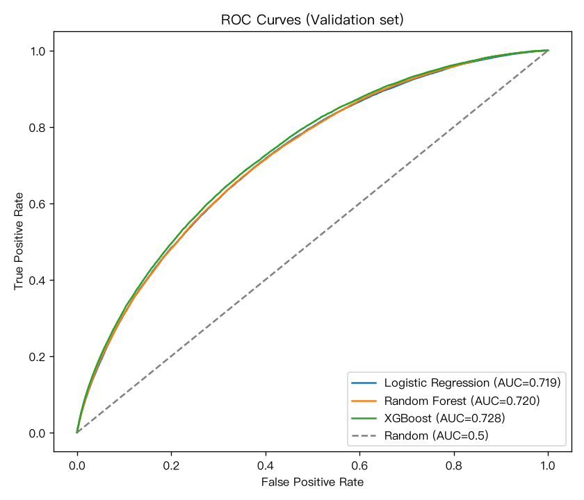
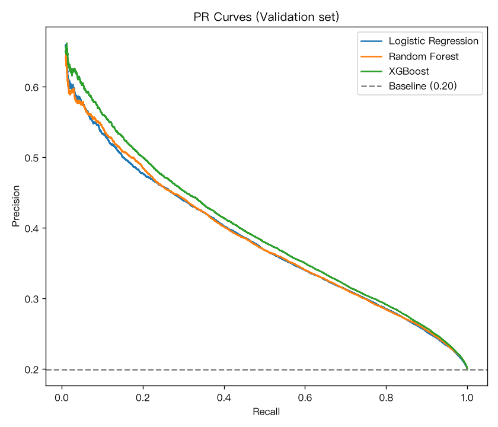
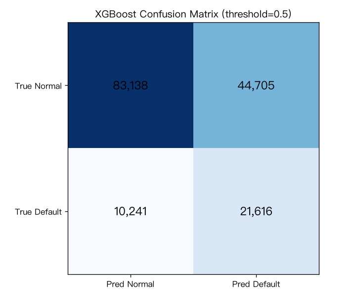

# 信贷违约预测项目 · 模型评估报告（W2 基线）

**项目**：基于用户历史数据与行为特征的信贷违约预测模型
**阶段**：W2 模型构建与评估（任务 4.1–4.4）
**输入**：`data/train_final.csv`（39 列，含 isDefault）
**代码**：`scripts/W2/model_training.py`
**产物**：`outputs/W2/model_comparison.csv`、`roc_curves.png`、`pr_curves.png`、`confusion_matrix_xgb.png`
**文档版本**：v1.3（2026/9/14 交付整理，按老师反馈补充第 3 节基线超参数配置）

## 摘要（给非技术读者的一句话结论）

- 三个模型（逻辑回归/随机森林/XGBoost）都**能有效区分违约者**（AUC≈0.72-0.73），XGBoost 最优（AUC 0.728）。
- 直观理解：随机抽一个违约者、一个不违约者，模型有约 73% 的概率把违约者排在前面——**可以辅助审批排序，但精度还不足以全自动放款**。
- 业务上核心的取舍：阈值放低"多抓坏人"（召回率高）还是放高"少误伤好人"（精确率高），取决于风控目标，阶段 6 业务解读将给出不同阈值下的对照供选择。
- 10% 测试集从 W2 起全程未使用，阶段 6 用它做最终评估，保证数字不虚。
- 本轮成绩出自**未调优的基线模型**：三个模型的超参数全部取官方默认或按数据规模设定的保守值，分类阈值统一用 0.5（详见第 3 节），W3 在此基础上调优。

## 1. 数据集划分（任务 4.1）

| 集合 | 样本数 | 占比 | 违约率 | 用途 |
|---|---|---|---|---|
| 训练集 | 558,948 | 70% | 19.95% | 训练模型 |
| 验证集 | 159,700 | 20% | 19.95% | 模型对比、选参数 |
| 测试集 | 79,850 | 10% | 19.95% | **阶段 6 最终评估，本阶段不碰** |

- 划分用 `stratify=y`（分层抽样）：每个集合的违约率都保持 19.95%，与总体一致，防止切分本身引入偏差。
- **测试集从 W2 起就切出但全程不使用**：如果反复用同一份数据调参，模型会被"背题"污染，阶段 6 的最终评估就失去意义。这是本项目最重要的一条数据纪律。

## 2. 三个模型：是什么、为什么选它们（任务 4.2）

| 模型 | 一句话原理 | 在本项目中的角色 |
|---|---|---|
| 逻辑回归 | 用一条线性公式 + sigmoid 输出违约概率 | **线性基准**：可解释、可向业务讲"每个特征加一单位概率怎么变" |
| 随机森林 | 很多棵决策树各自投票，取平均概率 | **非线性基准**：自动抓交互和非线性，不用人工造特征 |
| XGBoost | 一棵棵树接力，后面的树专门纠前面的错（梯度提升） | **主力候选**：通常精度最高，竞赛验证过 |

三者都输出 0–1 的概率，再用阈值（默认 0.5）切出"违约/不违约"标签。

## 3. 基线模型的超参数配置（2026/9/14 补充）

本轮三个模型**均未做任何调优**，超参数全部取"官方默认值 / 按数据规模设定的保守值"，目的是先拿到一组可比较的基线；W3 将以此为起点做网格与随机搜索调参，并对比调优前后。全部设定写在 `scripts/W2/model_training.py`，配合固定的随机种子（`random_state=42`）可完整复现。

下表只列出**我们主动设定过的参数 + 关键默认参数**（影响结果的旋钮）。其余未列出的参数一律取库的默认值，例如：逻辑回归的 `penalty='l2'`、`C=1.0`、`tol=1e-4`；随机森林的 `max_features='sqrt'`、`min_samples_leaf=1`、`bootstrap=True`；XGBoost 的 `subsample=1`、`colsample_bytree=1`、`min_child_weight=1`、`reg_lambda=1`。如需核对某个模型的全部参数，运行 `model.get_params()` 即可打印。

| 模型 | 超参数 | 取值 | 为什么这么设 |
|---|---|---|---|
| 逻辑回归 | `solver` | `lbfgs`（默认） | sklearn 默认求解器，适合本数据规模 |
| 逻辑回归 | `max_iter` | 1000 | 迭代上限放大到 1000，保证 55.9 万行样本能收敛（默认 100 会提前停止并报收敛警告） |
| 逻辑回归 | `class_weight` | `balanced` | 按类别频率自动加权，处理 1:4 不平衡（见第 4 节） |
| 逻辑回归 | `random_state` | 42 | 固定随机种子，结果可复现 |
| 随机森林 | `n_estimators` | 100 | 森林里 100 棵树；再多边际提升很小、训练更慢 |
| 随机森林 | `max_depth` | 12 | 限制树深（sklearn 默认不限深）：80 万行若让树自由生长会严重过拟合且极慢 |
| 随机森林 | `class_weight` | `balanced` | 同上 |
| 随机森林 | `n_jobs` | −1 | 用满全部 CPU 核心并行训练 |
| XGBoost | `n_estimators` | 100 | 提升轮数，即 100 棵"接力纠错树"（默认值） |
| XGBoost | `max_depth` | 6 | 每棵树最大深度 6，XGBoost 官方默认，也是防过拟合的常用起点 |
| XGBoost | `learning_rate` | 0.1 | 每棵树的贡献只加 10%（收缩步长）：步子小更稳、不易过拟合。**库默认是 0.3，我们取更保守的 0.1**（实战常用起点）；与 `n_estimators=100` 属"小步慢走"搭配，W3 将成对搜索这两个参数 |
| XGBoost | `scale_pos_weight` | 4.0129 | 训练集负样本 ÷ 正样本 = 447,447 ÷ 111,501，等价于把违约样本权重放大 4 倍 |
| XGBoost | `eval_metric` | `logloss` | 训练过程中监控用对数损失（二分类默认即为 logloss，此处显式写出以保证透明）；仅作训练路标，最终评估仍用 AUC/F1 等指标（见第 5、6 节） |
| XGBoost | `n_jobs` | −1 | 并行训练 |

三个模型共用的设定：

| 项目 | 取值 | 说明 |
|---|---|---|
| 分类阈值 | 0.5 | 预测概率 ≥ 0.5 判为违约；这是数学默认值，**不是业务最优值**（见第 7 节） |
| 随机种子 | `random_state=42` | 数据划分与三个模型统一固定，保证全程可复现 |
| 数据划分 | 训练 70% / 验证 20% / 测试 10%，`stratify=y` | 分层抽样，三份违约率均为 19.95%（见第 1 节） |
| 输入特征 | 38 个 | `data/train_final.csv`（特征工程产物） |

**一句话**：这一轮的定位是"**同一起跑线上的三条基线**"——超参数全部取默认或保守值，先摸清三模型的相对强弱和特征本身的信息上限；性能提升留给 W3 的调参、集成与阈值优化。

## 4. 类别不平衡处理

本项目违约率 20%（约 1:4），属于中度不平衡。处理方式：

- 逻辑回归 / 随机森林：`class_weight="balanced"` —— 少数类（违约）样本的错分代价自动提高；
- XGBoost：`scale_pos_weight = 负样本数/正样本数 ≈ 4.02` —— 等价于把违约样本的权重放大 4 倍。

目的：**不让模型偷懒成"全猜不违约"**（那样准确率 80% 但一个违约者都抓不到）。

## 5. 评估指标怎么读（任务 4.3）

用验证集（模型没见过的 15.97 万人）预测后，与真实 `isDefault` 对比计算：

| 指标 | 大白话 | 本项目关注度 |
|---|---|---|
| 准确率 | 判对的 ÷ 所有人 | 低：类别不平衡下失真（全猜"不违约"也有 80%） |
| 精确率 | 被判违约的人里，真违约的比例（抓得准不准） | 高：误伤一个好人 = 少一单好业务 |
| 召回率 | 真违约的人里，被抓到的比例（抓得全不全） | 高：漏掉一个坏人 = 一笔坏账 |
| F1 | 精确率与召回率的调和平均 | 中：两者均衡时的单值参考 |
| AUC-ROC | 随机抽一个违约者、一个不违约者，模型把违约者排前面的概率 | 高：只看排序能力，不依赖阈值 |

**关键认知（AUC 的常见误读）**：AUC=0.728 不是"预测对 72.8%"，而是"配对比较时违约者排前面的概率 72.8%"——它衡量的是模型给违约者排高分的能力，与具体阈值无关。

**精确率与召回率的此消彼长**：同一个阈值同时决定"抓谁"和"抓多少"。阈值高 → 只抓最有把握的（精确率高），但漏掉大量违约者（召回率低）；阈值低 → 几乎全抓（召回率高），但混入大量好人（精确率低）。两个都高，意味着模型能把两类人完美分开——现实数据做不到（特征信息有限），所以只能选平衡点。

## 6. 三模型验证集对比（任务 4.4）

| 模型 | 准确率 | 精确率 | 召回率 | F1 | AUC |
|---|---|---|---|---|---|
| 逻辑回归 | 0.6582 | 0.3241 | 0.6572 | 0.4341 | 0.7189 |
| 随机森林 | 0.6507 | 0.3208 | 0.6723 | 0.4343 | 0.7198 |
| **XGBoost** | 0.6559 | 0.3259 | 0.6785 | **0.4403** | **0.7276** |

**怎么读这张表**：
- **AUC 都约 0.72**：三模型"排序能力"接近，说明信息主要来自特征本身，模型形式差异不大——这是正常的，基线阶段先确认"能打"，W3 再通过调参进一步优化。
- **XGBoost 全面小幅领先**（AUC、F1、召回率均最高），与本项目"主力用 XGB"的预期一致。
- **精确率普遍偏低（~0.32）**：阈值 0.5 下模型为抓违约者（召回率 0.66–0.68）付出了"误伤大量好人"的代价——见第 7 节混淆矩阵。

## 7. 图形解读

**ROC 曲线**（`roc_curves.png`）：三模型曲线几乎重合且明显高于对角线（随机 0.5），说明"排序能力"有真实区分度，但三模型差别不大。XGB 略高，与 AUC 表一致。

> 图 1｜ROC 曲线（验证集，15.97 万人）：横轴 = 误伤率，纵轴 = 召回率；曲线越靠左上越好，三条均明显高于对角虚线（AUC 0.719–0.728）

**PR 曲线**（`pr_curves.png`）：
- 类别不平衡下 PR 比 ROC 更敏感（ROC 受大量"好人"稀释，PR 直接看"抓违约者这份名单的质量"）。
- 三模型曲线从左到右：左端（高阈值）精确率高、召回率低；右端（低阈值）反之，正是第 5 节"此消彼长"的可视化。
- 图注说明：**高分段（recall<1%）只有寥寥几个人被预测为正，精确率是纯统计噪声（如 3 人里对 1 个），故只展示 recall≥1% 区间**。

> 图 2｜PR 曲线（验证集）：横轴 = 召回率，纵轴 = 精确率；从左到右对应阈值由高到低；高分段样本极少属统计噪声，故只展示召回 ≥1% 区间

**混淆矩阵**（`confusion_matrix_xgb.png`，阈值 0.5）：
- 结构：误伤（真实不违约、被判违约）约 4.5 万人，远多于抓对（真实违约、被判违约）约 2.2 万人。
- 这正是精确率低（0.33）的直接原因：抓违约者 → 必然把大量边界上的好人一起抓进来。
- 业务含义：**0.5 这个默认阈值对风控太"激进"**——如果目标是"少放坏账"，可以接受；如果目标是"少误伤好客户"，则需要把阈值调高（正式阈值选择放在阶段 6 业务解读）。

> 图 3｜XGBoost 混淆矩阵（验证集，阈值 0.5）：抓对真违约者约 2.2 万、误伤好人约 4.5 万——精确率 0.33 的直接来源

## 8. 业务结论（给业务方的话）

1. **模型有效**：三模型 AUC ≈ 0.72，说明历史特征能显著区分违约者，可用于辅助风控决策——但还远达不到"直接自动审批"的程度（AUC 0.72 属中等水平，W3 调参后看能否提升）。
2. **最有信息的是贷款条件本身**：特征工程报告中 subGrade/利率/等级/期限排名前四，与 EDA 互相印证——风控部门可以把等级、利率作为第一道人工防线。
3. **阈值不是固定的**：0.5 只是默认值。业务上"抓坏人 vs 误伤好人"的取舍决定阈值：严审（高阈值，精确率高）适合高风险客群；宽进（低阈值，召回率高）适合需要放量获客的场景。阶段 6 业务解读将给出不同阈值下的精确率/召回率对照，供业务选择。
4. **测试集留白**：当前所有数字都是验证集（样本外）结果，阶段 6 将用从未碰过的 10% 测试集做最终确认，保证数字不虚。

## 9. 局限与下一步

- **局限**：基线未调参，超参数取默认/保守值（详见第 3 节）；未做特征与阈值的联合优化；匿名特征 n0–n14 无法解释，只能黑箱使用。
- **下一步（W3）**：网格/随机搜索调参 + K 折交叉验证、模型集成（投票/堆叠）、SHAP 特征解释，输出优化后模型与调参记录。
