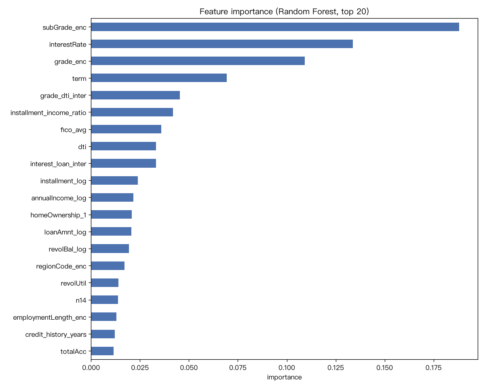
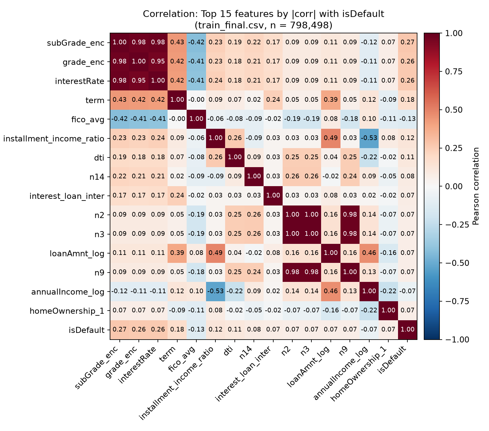

# 信贷违约预测项目 · 特征工程报告

**项目**：基于用户历史数据与行为特征的信贷违约预测模型
**阶段**：W2 特征工程（2026/9/7 – 9/13，任务 3.1–3.4）
**输入**：`data/train_clean.csv`（798,498 行 × 47 列，含 isDefault）、`data/testA_clean.csv`
**输出**：`data/train_final.csv`（798,498 行 × 39 列，含 isDefault）、`data/testA_final.csv`
**代码**：`scripts/W2/feature_engineering.py`
**产物**：`outputs/W2/feature_importance.csv/.png`、`correlation_heatmap.png`、`correlation_top15.png`
**文档版本**：v1.3（2026/9/14 交付整理，按老师反馈补充第 7 节相关性分析）

## 摘要（给非技术读者的一句话结论）

- 原始 47 个字段经编码、变换、创建、选择后，**最终保留 38 个特征**进入建模。
- 最有信息量的特征来自"**贷款条件本身**"：子等级（subGrade）、利率、等级、期限排名前四——与数据探索阶段的结论互相印证。
- 全程防数据泄漏：目标编码、标准化、缺失填充都只从训练集学习再应用到测试集，**保证测试集是模型真正"没见过"的数据**。
- 特征选择顺带发现：贷款用途（purpose）的独热列被全部删除，说明该变量单独看对违约预测贡献很小。
- **特征相关性分析（第 7 节）**：两种完全不同的方法（与目标的线性相关系数 vs 随机森林分裂贡献）给出的前四名完全一致（子等级、利率、等级、期限），互相印证；同时发现等级/利率/子等级三者高度共线（r≈0.95+），解释时需当作"一组信息"而非三个独立发现。

## 1. 总体思路

特征工程的目标：**把原始字段整理成模型"最吃得动"的输入**。三个动作对应三步：

1. **统一格式**（3.1 编码）：把文字类字段变成数字，模型才能算；
2. **统一尺度**（3.2 变换）：把右偏、量纲差异大的数值拉回"好算"的分布；
3. **筛选与组装**（3.3 + 3.4）：把领域知识变成新特征，再删掉弱特征，只喂给模型最有信息量的数据。

每一步都坚持一条底线：**任何从数据中学到的"规则"（编码映射、标准化参数、填充值）只能从训练集学，再套用到测试集**，否则测试集的信息会提前泄漏进模型，导致评估虚高（防数据泄漏，详见第 8 节）。

## 2. 删列决策（5 列）

| 列名 | 删除理由 |
|---|---|
| `id` | 纯标识符，无预测信息 |
| `policyCode` | 全表只有一个取值（常量），对模型零贡献 |
| `employmentTitle` | 取值数千个，无统一业务含义，编码后极端稀疏 |
| `postCode` | 邮编前 3 位，取值过多、含地区隐私噪声 |
| `title` | 借款人自填贷款名称，取值极多、杂乱 |

原则：**高基数 + 无业务解释价值**的列不做编码，直接删除；其余类别字段按第 3 节处理。

## 3. Step 1 类别编码（任务 3.1）

| 字段 | 编码方式 | 说明 |
|---|---|---|
| `grade`（A–G） | 序数编码 1–7 | 等级本身有序（A 最好），且 EDA 已确认违约率随等级单调上升 |
| `subGrade`（A1–G5） | 序数编码 1–35 | 35 档有序子等级，比 grade 更细 |
| `employmentLength` | 序数编码（<1 年=0，N 年=N，未知=-1） | 年限有序；"未知"保留为独立取值而不是丢弃 |
| `homeOwnership` / `verificationStatus` / `purpose` | 独热编码（drop_first=True） | 无序类别，不能用序数；drop_first 删基准类，避免计量中的"虚拟变量陷阱"（多重共线性） |
| `regionCode` | 目标编码（= 该地区训练集违约率） | 高基数地区变量，独热会太稀疏；用违约率浓缩信息 |

**关键决策：目标编码只用训练集违约率**。`regionCode_enc = 训练集该地区 isDefault 均值`；测试集出现的未知地区用总体违约率填充。若用全量数据（含测试集）算均值，就是典型的泄漏。

`term`（36/60 个月）、`initialListStatus`、`applicationType` 本身就是 0/1 或有序数值，无需额外编码，保留原列。

Step 1 产出：`train_encoded.csv`（59 列）。

## 4. Step 2 数值变换与标准化（任务 3.2）

**4-1 log1p 变换右偏金额列**：`loanAmnt`、`installment`、`annualIncome`、`revolBal`。
- 原因：EDA 已确认这四列严重右偏（少数人金额极高，长尾）。右偏会让模型（尤其线性模型）被极端值牵着走。
- `log1p(x) = ln(1+x)`：能压缩长尾、兼容 0 值；W1 EDA 中"收入取 log 后更接近钟形"的对照实验佐证了这一点。

**4-2 z-score 标准化**：对连续数值列统一 `(x - 均值) / 标准差`。
- 原因：不同字段量纲差异大（贷款金额十万级 vs 逾期次数个位数），线性回归/逻辑回归对量纲敏感。
- **不缩放**：目标变量 `isDefault`、0/1 二值列、时间字符串列（时间列在第 5 节专门处理）。
- **只 fit 训练集**，再 transform 训练/测试集（防泄漏）。

Step 2 产出：`train_scaled.csv`。

## 5. Step 3 特征创建（任务 3.3）

原则：**每个新特征都要能说出一句业务理由**，不为了加而加。

| 新特征 | 公式 | 业务理由 |
|---|---|---|
| `fico_avg` | (ficoRangeLow + ficoRangeHigh) / 2 | 上下限是同一评分的区间表示，合并成一个值 |
| `credit_history_years` | 发放年份 − 最早开卡年份 | 信用历史越长通常越可信；中位数 15 年 |
| `installment_income_ratio` | log(月供×12) − log(年收入) | 月供压力 = 每月还款占收入比重，衡量"还不起"的风险 |
| `grade_dti_inter` | grade_enc × dti | 交互项（计量思想）：高等级（差）且高负债，风险叠加 |
| `interest_loan_inter` | interestRate × log(loanAmnt) | 高利率 × 大金额，可能是高风险组合 |

新特征同样只 fit 训练集标准化后统一尺度。

## 6. Step 4 特征选择（任务 3.4）

用两种方法交叉判断（包装法 RFE 计算代价高，暂不采用；过滤法 + 嵌入法已交叉验证）：

**4-1 过滤法**：每个特征与 `isDefault` 的相关系数（绝对值）——单变量信号，快但只看"一对一"关系。相关系数 Top 5：subGrade_enc 0.268、grade_enc 0.262、interestRate 0.259、term 0.175、fico_avg 0.131（完整排名与特征之间的共线性结构见第 7 节）。

**4-2 嵌入法**：随机森林特征重要性——树模型分裂时按"基尼不纯度下降量"累计贡献（80 万行，约 1–3 分钟）。

**4-3 决策规则**：保留"重要性 ≥ 均值 × 1/10"的特征，低于阈值的尾部弱特征删除。

结果：**60 列（含标签）→ 保留 38 个特征**（删除 21 个弱特征）。删除清单：purpose 独热列 13 个**全部删除**、homeOwnership 独热列删 4 留 1、applicationType、匿名特征 n11–n13。

**两个发现**：① 被删的主要是"独热编码产生的小类别列"——样本占比小、单列信息量低；② `purpose`（贷款用途）的独热列被全部删除，说明该变量单独看对违约预测贡献很小（可能已被利率、等级等特征吸收），这是特征选择给出的可写进报告的客观结论。

**特征重要性 Top 5**：

| 特征 | 重要性 |
|---|---|
| subGrade_enc | 0.188 |
| interestRate | 0.134 |
| grade_enc | 0.109 |
| term | 0.069 |
| grade_dti_inter | 0.045 |

> 图 1｜随机森林特征重要性（Top 20）：柱长 = 对预测的贡献占比（全表归一为 1）；前四为 subGrade_enc、interestRate、grade_enc、term

**业务解读**：Top 特征全是"贷款定价与信用等级"类（利率、等级、期限），说明**贷款本身的条件里已经浓缩了大量风险信息**——这与 W1 EDA 的发现（等级 A→G 违约率单调上升）完全一致，互相印证。

Step 4 产出：`train_final.csv`（39 列）、`testA_final.csv`（38 列）、`outputs/W2/feature_importance.csv` 与 `feature_importance.png`（图 1）。

## 7. 特征相关性分析（2026/9/14 补充）

第 6 节回答的是"每个特征单独有多大用"，本节再补一层：**特征之间彼此重叠多少**（多重共线性），以及这对我们的模型意味着什么。代码：`scripts/W2/correlation_analysis.py`；基于最终 38 个建模特征（金额列已 log 变换、连续列已标准化）。

**先说明一点，避免误读**：本节两张图都只是**展示窗口**，不是特征筛选规则。38 个特征全画出来是 38×38 的格子，格内数字会小到看不清，所以 7-2 只画"与违约相关性最高的 **Top 15** 个特征"之间的矩阵。**模型实际输入始终是第 6 节选出的全部 38 个特征**，与本节展示 Top 15 是两件事——保留规则见第 6 节 4-3（重要性 ≥ 均值 × 1/10），和第 7 节无关。

**7-1 与目标变量的相关性（单变量信号）**：逐个算每个特征与 `isDefault` 的 Pearson 相关系数（0/1 独热列与目标的相关等于点二列相关，量级可比）：

| 排名 | 特征 | 相关系数 | 业务含义 |
|---|---|---|---|
| 1 | subGrade_enc（子等级） | +0.268 | 等级越差越容易违约 |
| 2 | grade_enc（等级） | +0.262 | 同上，粗粒度版 |
| 3 | interestRate（利率） | +0.259 | 利率高 = 定价环节已识别出高风险 |
| 4 | term（期限） | +0.175 | 60 个月长期贷款风险高于 36 个月 |
| 5 | fico_avg（FICO 均值） | −0.131 | 信用分越高越不违约（前 10 里唯一的负相关） |
| 6 | installment_income_ratio（月供收入比） | +0.122 | 还款压力越大越容易违约 |
| 7 | dti（债务收入比） | +0.107 | 负债越重越容易违约 |
| 8 | n14（匿名行为特征） | +0.085 | 匿名特征中信号最强的一个 |
| 9 | interest_loan_inter（利率×贷款额） | +0.072 | 自建交互项，进入前 10 |
| 10 | n2（匿名行为特征） | +0.070 | — |

**两个结论**：① 相关性排名与第 6 节的随机森林重要性排名**高度一致**（前四名完全相同：子等级、利率、等级、期限）。线性相关和树分裂的不纯度下降是两套完全不同的机制，却指向同一批特征，说明这个结论不依赖具体方法；② 单变量相关系数整体都不高（最高 0.27），**没有哪个变量能单独解释违约，靠的是多个弱信号叠加**——这也提前解释了为什么三模型 AUC 只能到 0.72–0.73：信息上限由数据决定，换模型也突破不了。

**7-2 特征之间的相关性（共线性结构）**：38 个特征两两计算，相关系数绝对值 ≥ 0.6 的高相关对共 **42 对**，前 8 对：

| 特征 A | 特征 B | 相关系数 | 怎么读 |
|---|---|---|---|
| n3 | n2 | +1.000 | 两个匿名特征几乎完全重复 |
| n10 | openAcc | +0.984 | 匿名特征与"未结信用额度数"高度重叠 |
| n3 | n9 | +0.982 | 匿名特征之间重复 |
| n2 | n9 | +0.982 | 同上 |
| installment_log | loanAmnt_log | +0.977 | 月供由贷款金额决定，属**预期相关** |
| subGrade_enc | interestRate | +0.977 | 等级决定利率，属**预期相关** |
| subGrade_enc | grade_enc | +0.976 | 子等级是等级的细分，天然重叠 |
| interestRate | grade_enc | +0.953 | 同上 |

> 图 2｜与违约相关性最高的 Top 15 特征之间的相关系数矩阵（红 = 正相关，蓝 = 负相关，格内数字为 Pearson r，n = 798,498）；**Top 15 只是为看清格内数字而选的展示窗口，模型仍使用全部 38 个特征**；图中右上角 subGrade/grade/interestRate 三者自成一个 0.95+ 的"高风险定价块"；不做筛选的完整矩阵见 `outputs/W2/correlation_heatmap.png`（39×39 全特征）

**7-3 高相关对模型意味着什么**：

- **对线性模型（逻辑回归）**：共线特征会让系数估计不稳定（和计量里多重共线性导致方差膨胀是同一件事），单个系数的符号甚至可能反直觉。所以本报告解读逻辑回归时**只看整体预测与排序能力（AUC），不逐条解读系数**。
- **对树模型（随机森林/XGBoost）**：分裂只看"哪个特征能带来最大的不纯度下降"，共线特征之间会互相**分摊**重要性（subGrade 与 interestRate 各拿一部分），但**预测能力不受影响**——这也是本项目主力用 XGBoost 的原因之一。
- **对特征选择**：既然 subGrade、grade、interestRate 三者信息高度重叠，就没必要再人为造同类特征；真正有价值的是**互补**特征——fico_avg 提供唯一的负向信号，installment_income_ratio 与 dti 提供"还款能力"这个新维度。
- **对业务解读**：向业务方讲"模型最看重什么"时，应说"**贷款定价与信用等级这一组信息**"（等级、利率、期限属同一逻辑），而不是把三者当成三个独立发现来汇报。

## 8. 防数据泄漏总结（重点）

三处"只从训练集学、再应用到测试集"：

| 位置 | 学到的规则 | 若泄漏会怎样 |
|---|---|---|
| regionCode 目标编码 | 各地区违约率 | 测试集标签信息混入特征，评估虚高 |
| StandardScaler | 均值、标准差 | 同上 |
| credit_history_years 中位数填充 | 中位数 | 同上 |

**判断标准**：任何在建模中"看到过标签"的统计量，都只能来自训练集。这保证测试集（以及未来的新客户数据）对模型而言是真正"没见过"的。

## 9. 下一步

特征工程产物（`train_final.csv`）将作为 W2 后半段**模型构建与评估**的输入（任务 4.1–4.4，70/20/10 划分、三模型对比）。
